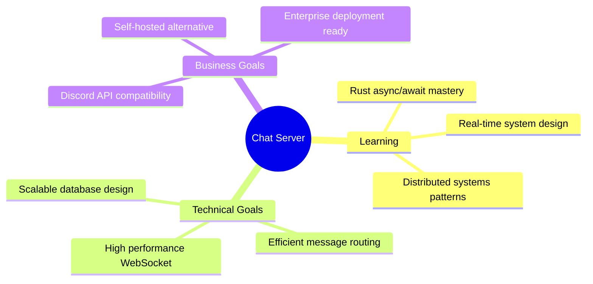
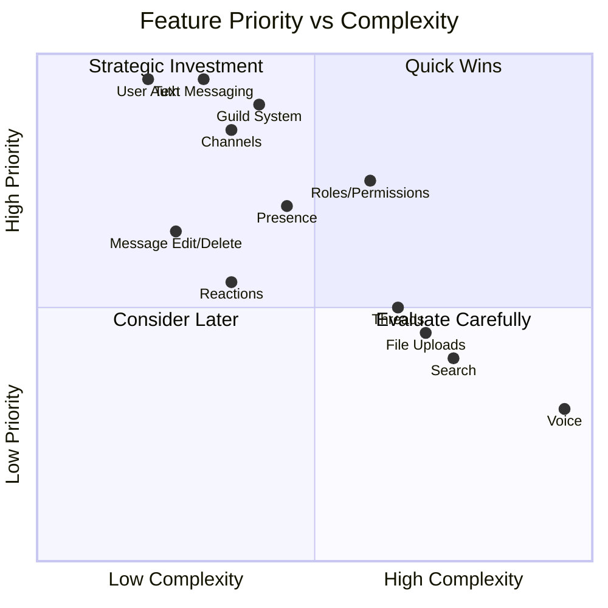
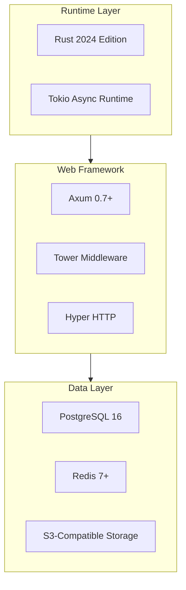
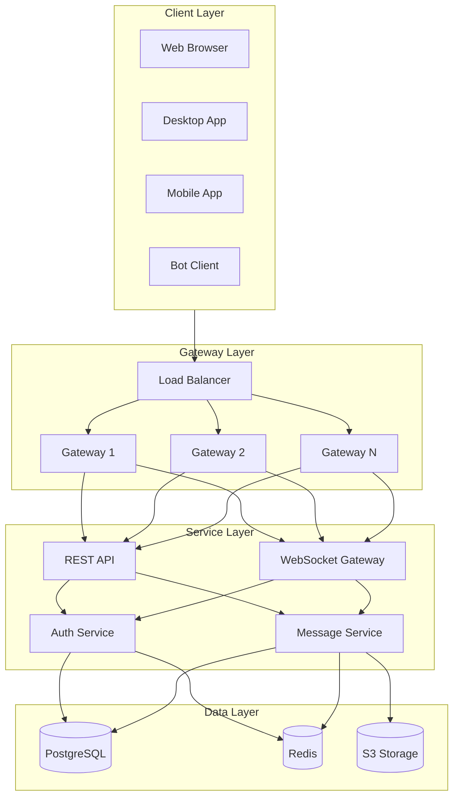
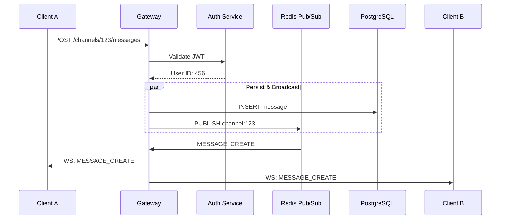
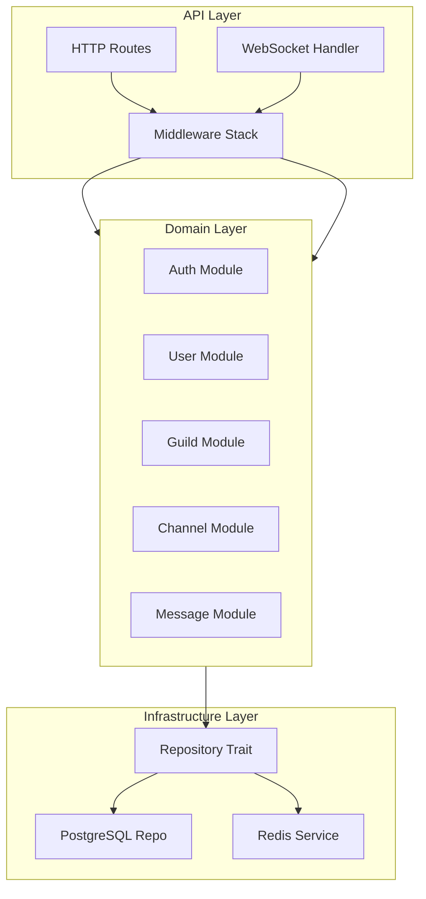
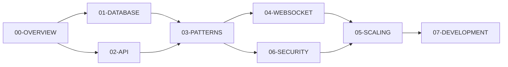

# Discord-like Chat Server - Project Overview

> **Last Updated**: 2025-12-17
> **Version**: 1.0.0
> **Status**: Architecture Phase

---

## 목차 (Table of Contents)

- [1. 프로젝트 비전 및 목표](#1-프로젝트-비전-및-목표-project-vision--goals)
- [2. 핵심 기능 요약](#2-핵심-기능-요약-core-features-summary)
- [3. 기술 스택 결정](#3-기술-스택-결정-technology-stack-decisions)
- [4. 아키텍처 개요](#4-아키텍처-개요-architecture-overview)
- [5. 문서 네비게이션 가이드](#5-문서-네비게이션-가이드-documentation-navigation-guide)
- [6. 의사결정 레코드 (ADR)](#6-의사결정-레코드-architectural-decision-records)
- [7. 프로젝트 로드맵](#7-프로젝트-로드맵-project-roadmap)
- [8. 참고 자료](#8-참고-자료-references)

---

## 1. 프로젝트 비전 및 목표 (Project Vision & Goals)

### 1.1 What We're Building

A **production-grade, Discord-compatible chat server** implemented in Rust, designed to handle real-time communication at scale.

**Primary Goals:**
1. **Discord API Compatibility**: Enable existing Discord bots and clients to connect with minimal modifications
2. **Demonstrate Rust's Strengths**: Leverage Rust's memory safety, performance, and concurrency
3. **Scale Progressively**: Start as a modular monolith, evolve to distributed microservices



### 1.2 Discord API Compatibility Goals

| Compatibility Level | Description | Target |
|---------------------|-------------|--------|
| **Gateway Protocol** | WebSocket opcodes, events, heartbeat | 95%+ |
| **REST API** | Endpoint structure, response format | 90%+ |
| **Data Models** | User, Guild, Channel, Message schemas | 90%+ |
| **Permissions** | 64-bit permission flags system | 100% |
| **Rate Limiting** | Bucket-based rate limiting | 100% |

**Out of Scope (for now):**
- Voice channels (WebRTC complexity)
- Rich presence for games
- Nitro/premium features
- Stage channels

### 1.3 Target Scale Matrix

| Phase | Concurrent Users | Messages/sec | Servers | Deployment |
|-------|------------------|--------------|---------|------------|
| **MVP** | 0 - 1,000 | 100 | 10 | Single instance |
| **Growth** | 1,000 - 10,000 | 1,000 | 100 | Load balanced |
| **Scale** | 10,000 - 100,000 | 10,000 | 1,000 | Distributed |
| **Enterprise** | 100,000+ | 100,000+ | 10,000+ | Multi-region |

---

## 2. 핵심 기능 요약 (Core Features Summary)

### 2.1 Feature Priority Matrix



### 2.2 Detailed Feature Breakdown

#### P0 - Critical (MVP Must-Have)

| Feature | Description | Technical Components |
|---------|-------------|---------------------|
| **User Authentication** | JWT-based auth with refresh tokens | `argon2`, `jsonwebtoken`, refresh rotation |
| **Text Messaging** | Real-time message delivery | WebSocket gateway, PostgreSQL, Redis pub/sub |
| **Server/Guild System** | Create, join, manage servers | CRUD, invite links, member management |
| **Channel Management** | Text channels with categories | Channel types, ordering, topics |
| **Basic Permissions** | VIEW_CHANNEL, SEND_MESSAGES | 64-bit flags, role hierarchy |

#### P1 - Important (Enhanced MVP)

| Feature | Description | Technical Components |
|---------|-------------|---------------------|
| **Role System** | Hierarchical roles with permissions | Role ordering, inheritance, hoisting |
| **Channel Permissions** | Per-channel permission overwrites | Allow/Deny system, calculation |
| **User Presence** | Online/Idle/DND/Offline status | Redis-based presence, heartbeat |
| **Message Edit/Delete** | Modify/remove messages | Edit history, soft delete, audit |
| **Typing Indicators** | Show when users are typing | Ephemeral events, timeout |

#### P2 - Nice to Have (Feature Complete)

| Feature | Description |
|---------|-------------|
| **Mentions** | @user, @role, @everyone, @here |
| **Reactions** | Emoji reactions on messages |
| **Threads** | Message-based sub-conversations |
| **Embeds** | Rich message embeds |
| **File Uploads** | Image/video/document sharing |

#### P3 - Future (Advanced Features)

| Feature | Description |
|---------|-------------|
| **Full-text Search** | Search message history |
| **Voice Channels** | Real-time voice communication |
| **Bot API** | Programmatic server control |
| **Webhooks** | HTTP callbacks for integrations |
| **Audit Logs** | Track administrative actions |

---

## 3. 기술 스택 결정 (Technology Stack Decisions)

### 3.1 Core Technology Choices



### 3.2 Framework Comparison: Axum vs Actix-web

| Criteria | Axum | Actix-web | Decision |
|----------|------|-----------|----------|
| **Tokio Integration** | Native | Compatible | Axum |
| **Type Safety** | Excellent | Good | Axum |
| **WebSocket Support** | Built-in | Actor-based | Both good |
| **Middleware** | Tower (rich) | Custom | **Axum** |
| **Learning Curve** | Moderate | Steeper | Axum |
| **Community Momentum** | Growing fast | Established | Axum |
| **Performance** | Excellent | Excellent | Tie |

**Why Axum?**
1. Native Tokio integration - no runtime friction
2. Tower middleware - reuse battle-tested components
3. Type-safe extractors - compile-time request verification
4. Developed by tokio team - aligned roadmap

### 3.3 Database: PostgreSQL vs Alternatives

| Criteria | PostgreSQL | MySQL | MongoDB | Decision |
|----------|------------|-------|---------|----------|
| **ACID Compliance** | Full | Full | Partial | PG/MySQL |
| **JSON Support** | Excellent (JSONB) | Good | Native | **PostgreSQL** |
| **Full-text Search** | Built-in | Basic | Atlas | **PostgreSQL** |
| **Partitioning** | Native | Native | Auto | **PostgreSQL** |
| **SQLx Support** | Excellent | Good | N/A | **PostgreSQL** |

**Why PostgreSQL?**
1. Rich query capabilities (CTEs, window functions)
2. JSONB for flexible schema (embeds, metadata)
3. Native table partitioning for messages
4. Built-in full-text search
5. Compile-time query verification with SQLx

### 3.4 Cache/Pub-Sub: Redis

| Criteria | Redis | KeyDB | NATS | Kafka | Decision |
|----------|-------|-------|------|-------|----------|
| **Latency** | Sub-ms | Sub-ms | Sub-ms | 2-10ms | Redis |
| **Pub/Sub** | Built-in | Built-in | Core | Topics | All good |
| **Data Structures** | Rich | Rich | Basic | Log only | **Redis** |
| **Rust Client** | Mature | Compatible | Growing | Mature | Redis |

**Why Redis?**
1. Versatility - cache, pub/sub, sessions, rate limiting in one
2. Mature Rust support via `redis` crate
3. Rich data structures for various use cases
4. Low latency critical for real-time features

### 3.5 Complete Dependencies

```toml
[dependencies]
# Runtime & Framework
tokio = { version = "1.35", features = ["full"] }
axum = { version = "0.7", features = ["ws", "macros", "multipart"] }
tower = "0.4"
tower-http = { version = "0.5", features = ["cors", "trace", "compression-gzip"] }

# Database
sqlx = { version = "0.7", features = ["runtime-tokio", "postgres", "uuid", "chrono", "json"] }

# Caching & Pub/Sub
redis = { version = "0.24", features = ["tokio-comp", "connection-manager"] }

# Authentication
jsonwebtoken = "9"
argon2 = "0.5"

# Serialization
serde = { version = "1", features = ["derive"] }
serde_json = "1"

# IDs & Time
uuid = { version = "1", features = ["v4", "v7", "serde"] }
chrono = { version = "0.4", features = ["serde"] }

# Utilities
dashmap = "5"
thiserror = "1"
anyhow = "1"
validator = { version = "0.18", features = ["derive"] }

# Observability
tracing = "0.1"
tracing-subscriber = { version = "0.3", features = ["env-filter", "json"] }
```

### 3.6 Trade-off Summary

| Decision | Trade-off Accepted | Mitigation |
|----------|-------------------|------------|
| **Axum over Actix** | Newer ecosystem | Tower compatibility |
| **PostgreSQL over CockroachDB** | Manual sharding | Partitioning + replicas |
| **Redis over Kafka** | Less durable | RDB/AOF persistence |
| **Monolith first** | Future refactoring | Clean module boundaries |

---

## 4. 아키텍처 개요 (Architecture Overview)

### 4.1 High-Level Architecture



### 4.2 Message Delivery Flow



### 4.3 Module Architecture



---

## 5. 문서 네비게이션 가이드 (Documentation Navigation Guide)

### 5.1 Document Map

| Document | Purpose | Read When... |
|----------|---------|--------------|
| **00-OVERVIEW.md** | Project scope, tech decisions | Starting the project |
| **01-DATABASE-SCHEMA.md** | Complete DB schema | Designing tables, writing migrations |
| **02-API-SPECIFICATION.md** | REST & WebSocket specs | Building endpoints |
| **03-ARCHITECTURE-PATTERNS.md** | Implementation patterns | Writing service code |
| **04-WEBSOCKET-GATEWAY.md** | Real-time features | Implementing gateway |
| **05-SCALING-STRATEGY.md** | Scaling & deployment | Preparing for production |
| **06-SECURITY.md** | Auth & security | Implementing security |
| **07-DEVELOPMENT-GUIDE.md** | Dev environment | Setting up locally |

### 5.2 Reading Order



---

## 6. 의사결정 레코드 (Architectural Decision Records)

### ADR-001: Use Axum as Web Framework
- **Status**: Accepted
- **Context**: Need performant, type-safe framework with WebSocket support
- **Decision**: Use Axum 0.7+ with Tower middleware
- **Rationale**: Native Tokio integration, excellent type safety

### ADR-002: Use PostgreSQL as Primary Database
- **Status**: Accepted
- **Context**: Need ACID-compliant storage with rich queries
- **Decision**: PostgreSQL 16 with table partitioning
- **Rationale**: Proven at scale, excellent Rust support

### ADR-003: Use Redis for Caching and Pub/Sub
- **Status**: Accepted
- **Context**: Need low-latency cache and real-time distribution
- **Decision**: Redis 7+ with cluster mode
- **Rationale**: Sub-millisecond latency, mature Rust client

### ADR-004: Modular Monolith for MVP
- **Status**: Accepted
- **Context**: Balance development speed with scalability
- **Decision**: Start monolith, extract services later
- **Rationale**: Faster iteration, clear boundaries for extraction

### ADR-005: Snowflake IDs for Messages
- **Status**: Accepted
- **Context**: Need globally unique, time-sortable IDs
- **Decision**: Discord-style Snowflake (64-bit)
- **Rationale**: Time-sortable, no coordination, Discord-compatible

### ADR-006: JWT with Refresh Token Rotation
- **Status**: Accepted
- **Context**: Need stateless auth with security
- **Decision**: Short JWT (15min) + rotating refresh (7 days)
- **Rationale**: Balance statelessness with security

---

## 7. 프로젝트 로드맵 (Project Roadmap)

### Phase 1: Foundation
- [ ] Project structure (clean architecture)
- [ ] PostgreSQL with SQLx migrations
- [ ] User registration with email verification
- [ ] JWT authentication with refresh tokens
- [ ] Basic error handling framework
- [ ] Structured logging with tracing

### Phase 2: Core MVP
- [ ] Guild CRUD with invite system
- [ ] Text channels with categories
- [ ] Message persistence with pagination
- [ ] WebSocket gateway (HELLO, IDENTIFY, HEARTBEAT)
- [ ] Real-time delivery via Redis pub/sub
- [ ] Basic rate limiting

### Phase 3: Enhanced Features
- [ ] Hierarchical role system
- [ ] 64-bit permission flags
- [ ] Channel permission overwrites
- [ ] Message editing with history
- [ ] User presence via Redis
- [ ] Typing indicators
- [ ] Emoji reactions
- [ ] Mentions (@user, @role)

### Phase 4: Scale & Polish
- [ ] Redis Cluster for pub/sub
- [ ] PostgreSQL read replicas
- [ ] S3-compatible file uploads
- [ ] Thread implementation
- [ ] Full-text search integration
- [ ] Prometheus/Grafana monitoring

### Phase 5: Advanced Features
- [ ] OAuth2 application registration
- [ ] Bot token generation
- [ ] Webhook delivery queue
- [ ] Audit logging system
- [ ] Voice channel research

---

## 8. 참고 자료 (References)

### Discord API
- [Discord Developer Portal](https://discord.com/developers/docs)
- [Gateway Events](https://discord.com/developers/docs/topics/gateway-events)
- [Permissions](https://discord.com/developers/docs/topics/permissions)

### Rust Ecosystem
- [Tokio](https://tokio.rs)
- [Axum](https://docs.rs/axum)
- [SQLx](https://docs.rs/sqlx)
- [Tracing](https://docs.rs/tracing)

### Design Patterns
- Clean Architecture by Robert Martin
- [Discord Engineering Blog](https://discord.com/blog)
- [Redis Pub/Sub Docs](https://redis.io/docs/interact/pubsub/)

---

## Glossary

| Term | Definition |
|------|------------|
| **Guild** | Discord's term for a server/community |
| **Channel** | Communication space within a guild |
| **Snowflake** | 64-bit unique ID with embedded timestamp |
| **Gateway** | WebSocket connection for real-time events |
| **Opcode** | Operation code identifying message type |
| **Presence** | User's online status and activity |

---

*This document serves as the entry point for the Discord-like Chat Server project.*
