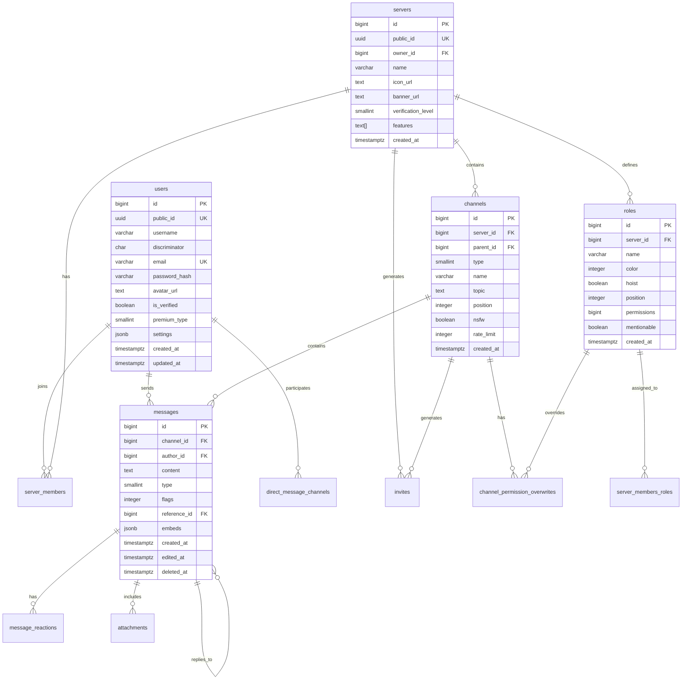
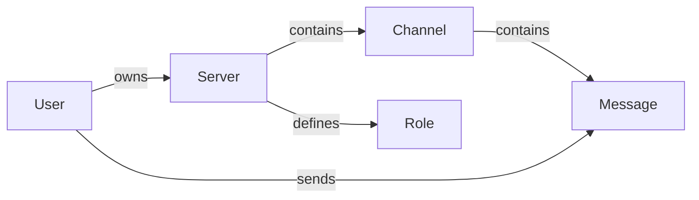

# Database Schema Design

> **Database**: PostgreSQL 16+
> **ORM**: SQLx with compile-time verification
> **Last Updated**: 2025-12-17

---

## 목차 (Table of Contents)

- [1. 스키마 개요](#1-스키마-개요-schema-overview)
- [2. 핵심 테이블](#2-핵심-테이블-core-tables)
- [3. 관계 설계](#3-관계-설계-relationships)
- [4. 인덱스 전략](#4-인덱스-전략-index-strategy)
- [5. 파티셔닝 전략](#5-파티셔닝-전략-partitioning)
- [6. 트리거 및 함수](#6-트리거-및-함수-triggers--functions)
- [7. 뷰 설계](#7-뷰-설계-views)
- [8. 마이그레이션 전략](#8-마이그레이션-전략-migration-strategy)
- [9. 데이터 아카이빙](#9-데이터-아카이빙-archiving)
- [10. 백업 및 복구](#10-백업-및-복구-backup--recovery)
- [11. sqlx 통합](#11-sqlx-통합-sqlx-integration)

---

## 1. 스키마 개요 (Schema Overview)

### 1.1 ER Diagram



### 1.2 Design Philosophy

| Principle | Implementation |
|-----------|----------------|
| **Soft Deletes** | `deleted_at` column for recoverable data |
| **Audit Trail** | `created_at`, `updated_at` on all tables |
| **Snowflake IDs** | 64-bit IDs for time-sorting capability |
| **UUID Public IDs** | UUIDs for external API exposure |
| **Denormalization** | Strategic caching in Redis |
| **Partitioning** | Time-based for messages table |

### 1.3 Naming Conventions

| Element | Convention | Example |
|---------|------------|---------|
| Tables | snake_case, plural | `server_members` |
| Columns | snake_case | `created_at` |
| Primary Keys | `id` | `users.id` |
| Foreign Keys | `{table}_id` | `server_id` |
| Indexes | `idx_{table}_{columns}` | `idx_messages_channel_id` |
| Constraints | `{table}_{type}_{columns}` | `users_uk_email` |

---

## 2. 핵심 테이블 (Core Tables)

### 2.1 Users Table

```sql
-- Users table with Discord-compatible fields
CREATE TABLE users (
    -- Primary identifier (Snowflake ID)
    id BIGINT PRIMARY KEY DEFAULT generate_snowflake_id(),

    -- Public UUID for API exposure (prevents ID enumeration)
    public_id UUID NOT NULL DEFAULT gen_random_uuid() UNIQUE,

    -- Username (2-32 characters, alphanumeric + underscore)
    username VARCHAR(32) NOT NULL
        CONSTRAINT users_ck_username CHECK (
            username ~ '^[a-zA-Z0-9_]{2,32}$'
        ),

    -- Discriminator (4-digit tag, e.g., #0001)
    discriminator CHAR(4) NOT NULL DEFAULT '0001'
        CONSTRAINT users_ck_discriminator CHECK (
            discriminator ~ '^[0-9]{4}$'
        ),

    -- Email (unique, normalized to lowercase)
    email VARCHAR(255) NOT NULL UNIQUE
        CONSTRAINT users_ck_email CHECK (
            email ~* '^[A-Za-z0-9._%+-]+@[A-Za-z0-9.-]+\.[A-Za-z]{2,}$'
        ),

    -- Password hash (Argon2id)
    password_hash VARCHAR(255) NOT NULL,

    -- Profile customization
    avatar_url TEXT,
    banner_url TEXT,
    bio VARCHAR(190),

    -- Account status
    is_verified BOOLEAN NOT NULL DEFAULT FALSE,
    is_bot BOOLEAN NOT NULL DEFAULT FALSE,
    is_system BOOLEAN NOT NULL DEFAULT FALSE,

    -- Premium status (0=none, 1=nitro_classic, 2=nitro, 3=nitro_basic)
    premium_type SMALLINT NOT NULL DEFAULT 0
        CONSTRAINT users_ck_premium_type CHECK (premium_type BETWEEN 0 AND 3),

    -- User settings (JSON for flexibility)
    settings JSONB NOT NULL DEFAULT '{}'::jsonb,

    -- Timestamps
    created_at TIMESTAMPTZ NOT NULL DEFAULT NOW(),
    updated_at TIMESTAMPTZ NOT NULL DEFAULT NOW(),
    deleted_at TIMESTAMPTZ,

    -- Unique username#discriminator combination
    CONSTRAINT users_uk_username_discriminator
        UNIQUE (username, discriminator)
);

-- Example data
INSERT INTO users (username, discriminator, email, password_hash, is_verified) VALUES
('admin', '0001', 'admin@example.com', '$argon2id$v=19$m=65536,t=3,p=4$...', TRUE),
('testuser', '1234', 'test@example.com', '$argon2id$v=19$m=65536,t=3,p=4$...', FALSE);
```

**Column Explanations:**

| Column | Purpose | Why? |
|--------|---------|------|
| `id` | Internal identifier | Snowflake for time-sorting |
| `public_id` | External API identifier | Prevents ID enumeration attacks |
| `discriminator` | Username tag | Allows duplicate usernames |
| `settings` | User preferences | JSONB for schema flexibility |
| `deleted_at` | Soft delete marker | Data recovery capability |

### 2.2 Servers (Guilds) Table

```sql
CREATE TABLE servers (
    id BIGINT PRIMARY KEY DEFAULT generate_snowflake_id(),
    public_id UUID NOT NULL DEFAULT gen_random_uuid() UNIQUE,

    -- Owner (user who created the server)
    owner_id BIGINT NOT NULL REFERENCES users(id) ON DELETE RESTRICT,

    -- Server identity
    name VARCHAR(100) NOT NULL
        CONSTRAINT servers_ck_name CHECK (char_length(name) >= 2),
    description VARCHAR(1000),

    -- Media
    icon_url TEXT,
    banner_url TEXT,
    splash_url TEXT,

    -- Settings
    verification_level SMALLINT NOT NULL DEFAULT 0
        CONSTRAINT servers_ck_verification CHECK (verification_level BETWEEN 0 AND 4),
    default_message_notifications SMALLINT NOT NULL DEFAULT 0,
    explicit_content_filter SMALLINT NOT NULL DEFAULT 0,

    -- Features (array of feature flags)
    features TEXT[] NOT NULL DEFAULT '{}',

    -- Boost status
    premium_tier SMALLINT NOT NULL DEFAULT 0,
    premium_subscription_count INTEGER NOT NULL DEFAULT 0,

    -- System channel for welcome messages
    system_channel_id BIGINT,
    rules_channel_id BIGINT,

    -- Vanity URL (premium feature)
    vanity_url_code VARCHAR(32) UNIQUE,

    -- Member limits
    max_members INTEGER NOT NULL DEFAULT 500000,

    -- Timestamps
    created_at TIMESTAMPTZ NOT NULL DEFAULT NOW(),
    updated_at TIMESTAMPTZ NOT NULL DEFAULT NOW(),
    deleted_at TIMESTAMPTZ
);

-- Add foreign key after channels table exists
-- ALTER TABLE servers ADD CONSTRAINT servers_fk_system_channel
--     FOREIGN KEY (system_channel_id) REFERENCES channels(id);
```

### 2.3 Channels Table

```sql
-- Channel types enum
-- 0 = GUILD_TEXT
-- 1 = DM
-- 2 = GUILD_VOICE
-- 3 = GROUP_DM
-- 4 = GUILD_CATEGORY
-- 5 = GUILD_ANNOUNCEMENT
-- 10 = ANNOUNCEMENT_THREAD
-- 11 = PUBLIC_THREAD
-- 12 = PRIVATE_THREAD
-- 13 = GUILD_STAGE_VOICE
-- 14 = GUILD_DIRECTORY
-- 15 = GUILD_FORUM

CREATE TABLE channels (
    id BIGINT PRIMARY KEY DEFAULT generate_snowflake_id(),

    -- Server association (NULL for DMs)
    server_id BIGINT REFERENCES servers(id) ON DELETE CASCADE,

    -- Parent category or thread parent
    parent_id BIGINT REFERENCES channels(id) ON DELETE SET NULL,

    -- Channel type
    type SMALLINT NOT NULL DEFAULT 0
        CONSTRAINT channels_ck_type CHECK (type IN (0,1,2,3,4,5,10,11,12,13,14,15)),

    -- Channel identity
    name VARCHAR(100) NOT NULL
        CONSTRAINT channels_ck_name CHECK (char_length(name) >= 1),
    topic VARCHAR(1024),

    -- Ordering within category
    position INTEGER NOT NULL DEFAULT 0,

    -- Settings
    nsfw BOOLEAN NOT NULL DEFAULT FALSE,
    rate_limit_per_user INTEGER NOT NULL DEFAULT 0
        CONSTRAINT channels_ck_rate_limit CHECK (rate_limit_per_user BETWEEN 0 AND 21600),

    -- Voice channel settings
    bitrate INTEGER DEFAULT 64000,
    user_limit INTEGER DEFAULT 0,

    -- Thread settings
    default_auto_archive_duration INTEGER DEFAULT 1440, -- minutes

    -- Permissions
    permission_overwrites JSONB NOT NULL DEFAULT '[]'::jsonb,

    -- Last activity (for sorting)
    last_message_id BIGINT,
    last_pin_timestamp TIMESTAMPTZ,

    -- Timestamps
    created_at TIMESTAMPTZ NOT NULL DEFAULT NOW(),
    updated_at TIMESTAMPTZ NOT NULL DEFAULT NOW(),
    deleted_at TIMESTAMPTZ,

    -- Server channels must have server_id
    CONSTRAINT channels_ck_server_required CHECK (
        type IN (1, 3) OR server_id IS NOT NULL
    )
);
```

### 2.4 Messages Table (Partitioned)

```sql
-- Messages table with time-based partitioning
CREATE TABLE messages (
    id BIGINT NOT NULL DEFAULT generate_snowflake_id(),
    channel_id BIGINT NOT NULL,
    author_id BIGINT NOT NULL,

    -- Content (up to 4000 chars for Nitro, 2000 for regular)
    content TEXT,

    -- Message type
    -- 0 = DEFAULT
    -- 1 = RECIPIENT_ADD
    -- 2 = RECIPIENT_REMOVE
    -- 3 = CALL
    -- 4 = CHANNEL_NAME_CHANGE
    -- 5 = CHANNEL_ICON_CHANGE
    -- 6 = CHANNEL_PINNED_MESSAGE
    -- 7 = USER_JOIN
    -- 8 = GUILD_BOOST
    -- 19 = REPLY
    -- 20 = CHAT_INPUT_COMMAND
    type SMALLINT NOT NULL DEFAULT 0,

    -- Message flags (bitfield)
    -- 1 << 0 = CROSSPOSTED
    -- 1 << 1 = IS_CROSSPOST
    -- 1 << 2 = SUPPRESS_EMBEDS
    -- 1 << 3 = SOURCE_MESSAGE_DELETED
    -- 1 << 4 = URGENT
    flags INTEGER NOT NULL DEFAULT 0,

    -- Reply reference
    reference_message_id BIGINT,
    reference_channel_id BIGINT,
    reference_server_id BIGINT,

    -- Rich content
    embeds JSONB NOT NULL DEFAULT '[]'::jsonb,
    mentions BIGINT[] NOT NULL DEFAULT '{}',
    mention_roles BIGINT[] NOT NULL DEFAULT '{}',
    mention_everyone BOOLEAN NOT NULL DEFAULT FALSE,

    -- Edit tracking
    edited_at TIMESTAMPTZ,

    -- Timestamps
    created_at TIMESTAMPTZ NOT NULL DEFAULT NOW(),
    deleted_at TIMESTAMPTZ,

    -- Composite primary key for partitioning
    PRIMARY KEY (id, created_at)
) PARTITION BY RANGE (created_at);

-- Create partitions for current and next months
CREATE TABLE messages_2025_01 PARTITION OF messages
    FOR VALUES FROM ('2025-01-01') TO ('2025-02-01');
CREATE TABLE messages_2025_02 PARTITION OF messages
    FOR VALUES FROM ('2025-02-01') TO ('2025-03-01');
-- Continue for future months...

-- Default partition for any data outside defined ranges
CREATE TABLE messages_default PARTITION OF messages DEFAULT;
```

### 2.5 Roles Table

```sql
CREATE TABLE roles (
    id BIGINT PRIMARY KEY DEFAULT generate_snowflake_id(),
    server_id BIGINT NOT NULL REFERENCES servers(id) ON DELETE CASCADE,

    -- Role identity
    name VARCHAR(100) NOT NULL,
    color INTEGER NOT NULL DEFAULT 0, -- RGB color as integer

    -- Display settings
    hoist BOOLEAN NOT NULL DEFAULT FALSE, -- Display separately
    position INTEGER NOT NULL DEFAULT 0,
    icon_url TEXT,
    unicode_emoji VARCHAR(32),

    -- Permissions (64-bit bitfield)
    permissions BIGINT NOT NULL DEFAULT 0,

    -- Mention settings
    mentionable BOOLEAN NOT NULL DEFAULT FALSE,

    -- Bot role flag
    managed BOOLEAN NOT NULL DEFAULT FALSE,

    -- Timestamps
    created_at TIMESTAMPTZ NOT NULL DEFAULT NOW(),
    updated_at TIMESTAMPTZ NOT NULL DEFAULT NOW(),

    -- Unique position per server
    CONSTRAINT roles_uk_server_position UNIQUE (server_id, position)
);

-- @everyone role is created automatically with server
-- Position 0 is reserved for @everyone
```

### 2.6 Server Members Table

```sql
CREATE TABLE server_members (
    server_id BIGINT NOT NULL REFERENCES servers(id) ON DELETE CASCADE,
    user_id BIGINT NOT NULL REFERENCES users(id) ON DELETE CASCADE,

    -- Member-specific nickname
    nickname VARCHAR(32),

    -- Member avatar override
    avatar_url TEXT,

    -- Join information
    joined_at TIMESTAMPTZ NOT NULL DEFAULT NOW(),

    -- Premium (Nitro boost) since
    premium_since TIMESTAMPTZ,

    -- Communication settings
    deaf BOOLEAN NOT NULL DEFAULT FALSE,
    mute BOOLEAN NOT NULL DEFAULT FALSE,

    -- Pending membership (verification required)
    pending BOOLEAN NOT NULL DEFAULT FALSE,

    -- Timeout (temporary mute)
    communication_disabled_until TIMESTAMPTZ,

    -- Timestamps
    created_at TIMESTAMPTZ NOT NULL DEFAULT NOW(),
    updated_at TIMESTAMPTZ NOT NULL DEFAULT NOW(),

    PRIMARY KEY (server_id, user_id)
);

-- Junction table for member roles
CREATE TABLE server_members_roles (
    server_id BIGINT NOT NULL,
    user_id BIGINT NOT NULL,
    role_id BIGINT NOT NULL REFERENCES roles(id) ON DELETE CASCADE,

    assigned_at TIMESTAMPTZ NOT NULL DEFAULT NOW(),

    PRIMARY KEY (server_id, user_id, role_id),
    FOREIGN KEY (server_id, user_id)
        REFERENCES server_members(server_id, user_id) ON DELETE CASCADE
);
```

### 2.7 Channel Permission Overwrites

```sql
CREATE TABLE channel_permission_overwrites (
    channel_id BIGINT NOT NULL REFERENCES channels(id) ON DELETE CASCADE,

    -- Target type: 0 = role, 1 = member
    target_type SMALLINT NOT NULL
        CONSTRAINT overwrites_ck_target_type CHECK (target_type IN (0, 1)),

    -- Target ID (role_id or user_id)
    target_id BIGINT NOT NULL,

    -- Permission bits
    allow BIGINT NOT NULL DEFAULT 0,
    deny BIGINT NOT NULL DEFAULT 0,

    created_at TIMESTAMPTZ NOT NULL DEFAULT NOW(),
    updated_at TIMESTAMPTZ NOT NULL DEFAULT NOW(),

    PRIMARY KEY (channel_id, target_type, target_id)
);
```

### 2.8 Message Reactions

```sql
CREATE TABLE message_reactions (
    message_id BIGINT NOT NULL,
    message_created_at TIMESTAMPTZ NOT NULL, -- For partition routing
    user_id BIGINT NOT NULL REFERENCES users(id) ON DELETE CASCADE,

    -- Emoji (either unicode or custom emoji ID)
    emoji_id BIGINT, -- NULL for unicode emoji
    emoji_name VARCHAR(32) NOT NULL, -- Unicode char or custom emoji name
    emoji_animated BOOLEAN NOT NULL DEFAULT FALSE,

    created_at TIMESTAMPTZ NOT NULL DEFAULT NOW(),

    PRIMARY KEY (message_id, message_created_at, user_id, COALESCE(emoji_id, 0), emoji_name),
    FOREIGN KEY (message_id, message_created_at)
        REFERENCES messages(id, created_at) ON DELETE CASCADE
);
```

### 2.9 Attachments

```sql
CREATE TABLE attachments (
    id BIGINT PRIMARY KEY DEFAULT generate_snowflake_id(),
    message_id BIGINT NOT NULL,
    message_created_at TIMESTAMPTZ NOT NULL,

    -- File information
    filename VARCHAR(255) NOT NULL,
    content_type VARCHAR(127),
    size INTEGER NOT NULL,

    -- URLs
    url TEXT NOT NULL,
    proxy_url TEXT,

    -- Image dimensions (if applicable)
    width INTEGER,
    height INTEGER,

    -- Audio duration (if applicable)
    duration_secs FLOAT,

    -- Flags
    ephemeral BOOLEAN NOT NULL DEFAULT FALSE,

    created_at TIMESTAMPTZ NOT NULL DEFAULT NOW(),

    FOREIGN KEY (message_id, message_created_at)
        REFERENCES messages(id, created_at) ON DELETE CASCADE
);
```

### 2.10 Invites

```sql
CREATE TABLE invites (
    code VARCHAR(32) PRIMARY KEY,

    server_id BIGINT NOT NULL REFERENCES servers(id) ON DELETE CASCADE,
    channel_id BIGINT NOT NULL REFERENCES channels(id) ON DELETE CASCADE,
    inviter_id BIGINT REFERENCES users(id) ON DELETE SET NULL,

    -- Usage limits
    max_uses INTEGER NOT NULL DEFAULT 0, -- 0 = unlimited
    uses INTEGER NOT NULL DEFAULT 0,
    max_age INTEGER NOT NULL DEFAULT 86400, -- seconds, 0 = never expires

    -- Flags
    temporary BOOLEAN NOT NULL DEFAULT FALSE,

    -- Target for voice channel invites
    target_type SMALLINT,
    target_user_id BIGINT REFERENCES users(id) ON DELETE SET NULL,

    created_at TIMESTAMPTZ NOT NULL DEFAULT NOW(),
    expires_at TIMESTAMPTZ GENERATED ALWAYS AS (
        CASE WHEN max_age = 0 THEN NULL
        ELSE created_at + (max_age || ' seconds')::interval
        END
    ) STORED
);
```

### 2.11 Audit Logs

```sql
CREATE TABLE audit_logs (
    id BIGINT PRIMARY KEY DEFAULT generate_snowflake_id(),
    server_id BIGINT NOT NULL REFERENCES servers(id) ON DELETE CASCADE,

    -- Actor
    user_id BIGINT REFERENCES users(id) ON DELETE SET NULL,

    -- Action type (Discord audit log events)
    action_type SMALLINT NOT NULL,

    -- Target
    target_id BIGINT,
    target_type VARCHAR(32),

    -- Changes
    changes JSONB,

    -- Additional data
    options JSONB,
    reason VARCHAR(512),

    created_at TIMESTAMPTZ NOT NULL DEFAULT NOW()
) PARTITION BY RANGE (created_at);

-- Partitions similar to messages table
```

---

## 3. 관계 설계 (Relationships)

### 3.1 One-to-Many Relationships



### 3.2 Many-to-Many Relationships

**Users ↔ Servers (via server_members)**
```sql
-- Get all servers a user belongs to
SELECT s.* FROM servers s
JOIN server_members sm ON s.id = sm.server_id
WHERE sm.user_id = $1 AND s.deleted_at IS NULL;

-- Get all members of a server
SELECT u.* FROM users u
JOIN server_members sm ON u.id = sm.user_id
WHERE sm.server_id = $1 AND u.deleted_at IS NULL;
```

**Members ↔ Roles (via server_members_roles)**
```sql
-- Get all roles for a member
SELECT r.* FROM roles r
JOIN server_members_roles smr ON r.id = smr.role_id
WHERE smr.server_id = $1 AND smr.user_id = $2
ORDER BY r.position DESC;
```

### 3.3 Self-Referential Relationships

**Channels (parent_id → channels.id)**
```sql
-- Get all channels in a category
SELECT * FROM channels
WHERE parent_id = $1 AND deleted_at IS NULL
ORDER BY position;

-- Get channel hierarchy
WITH RECURSIVE channel_tree AS (
    SELECT id, name, parent_id, type, 0 as depth
    FROM channels
    WHERE server_id = $1 AND parent_id IS NULL

    UNION ALL

    SELECT c.id, c.name, c.parent_id, c.type, ct.depth + 1
    FROM channels c
    JOIN channel_tree ct ON c.parent_id = ct.id
)
SELECT * FROM channel_tree ORDER BY depth, position;
```

**Messages (reference_message_id → messages.id)**
```sql
-- Get reply chain
WITH RECURSIVE reply_chain AS (
    SELECT id, content, reference_message_id, 0 as depth
    FROM messages
    WHERE id = $1

    UNION ALL

    SELECT m.id, m.content, m.reference_message_id, rc.depth + 1
    FROM messages m
    JOIN reply_chain rc ON m.id = rc.reference_message_id
    WHERE rc.depth < 10 -- Limit depth
)
SELECT * FROM reply_chain;
```

---

## 4. 인덱스 전략 (Index Strategy)

### 4.1 Users Indexes

```sql
-- Email lookup (login)
CREATE UNIQUE INDEX idx_users_email
ON users (lower(email))
WHERE deleted_at IS NULL;

-- Username search (trigram for fuzzy search)
CREATE EXTENSION IF NOT EXISTS pg_trgm;
CREATE INDEX idx_users_username_trgm
ON users USING gin (username gin_trgm_ops);

-- Username#discriminator lookup
CREATE UNIQUE INDEX idx_users_username_discriminator
ON users (username, discriminator)
WHERE deleted_at IS NULL;

-- Public ID lookup (API)
CREATE UNIQUE INDEX idx_users_public_id
ON users (public_id);
```

### 4.2 Messages Indexes

```sql
-- Channel messages (keyset pagination)
CREATE INDEX idx_messages_channel_created
ON messages (channel_id, created_at DESC, id DESC)
WHERE deleted_at IS NULL;

-- Author messages
CREATE INDEX idx_messages_author
ON messages (author_id, created_at DESC)
WHERE deleted_at IS NULL;

-- Full-text search
CREATE INDEX idx_messages_content_fts
ON messages USING gin (to_tsvector('simple', content))
WHERE content IS NOT NULL AND deleted_at IS NULL;

-- BRIN index for time-based queries
CREATE INDEX idx_messages_created_brin
ON messages USING brin (created_at);

-- Mentions search
CREATE INDEX idx_messages_mentions
ON messages USING gin (mentions)
WHERE deleted_at IS NULL;
```

### 4.3 Server Members Indexes

```sql
-- List members of server
CREATE INDEX idx_server_members_server
ON server_members (server_id, joined_at);

-- List servers of user
CREATE INDEX idx_server_members_user
ON server_members (user_id);

-- Role assignments
CREATE INDEX idx_server_members_roles_role
ON server_members_roles (role_id);
```

### 4.4 Channels Indexes

```sql
-- Server channels
CREATE INDEX idx_channels_server_position
ON channels (server_id, position)
WHERE deleted_at IS NULL;

-- Category children
CREATE INDEX idx_channels_parent
ON channels (parent_id)
WHERE deleted_at IS NULL;
```

---

## 5. 파티셔닝 전략 (Partitioning)

### 5.1 Automatic Partition Creation

```sql
-- Function to create monthly partitions
CREATE OR REPLACE FUNCTION create_monthly_partition(
    table_name TEXT,
    start_date DATE
)
RETURNS VOID AS $$
DECLARE
    partition_name TEXT;
    end_date DATE;
BEGIN
    partition_name := table_name || '_' || to_char(start_date, 'YYYY_MM');
    end_date := start_date + INTERVAL '1 month';

    EXECUTE format(
        'CREATE TABLE IF NOT EXISTS %I PARTITION OF %I
         FOR VALUES FROM (%L) TO (%L)',
        partition_name,
        table_name,
        start_date,
        end_date
    );

    RAISE NOTICE 'Created partition: %', partition_name;
END;
$$ LANGUAGE plpgsql;

-- Function to create partitions for the next N months
CREATE OR REPLACE FUNCTION ensure_future_partitions(
    table_name TEXT,
    months_ahead INTEGER DEFAULT 3
)
RETURNS VOID AS $$
DECLARE
    current_month DATE;
    i INTEGER;
BEGIN
    current_month := date_trunc('month', CURRENT_DATE);

    FOR i IN 0..months_ahead LOOP
        PERFORM create_monthly_partition(
            table_name,
            current_month + (i || ' months')::interval
        );
    END LOOP;
END;
$$ LANGUAGE plpgsql;

-- Schedule partition creation (run monthly via pg_cron)
-- SELECT cron.schedule('create_partitions', '0 0 1 * *',
--     $$SELECT ensure_future_partitions('messages', 3)$$);
```

### 5.2 Partition Maintenance

```sql
-- Drop old partitions (data archiving)
CREATE OR REPLACE FUNCTION drop_old_partitions(
    table_name TEXT,
    retention_months INTEGER
)
RETURNS VOID AS $$
DECLARE
    partition_record RECORD;
    cutoff_date DATE;
BEGIN
    cutoff_date := date_trunc('month', CURRENT_DATE) -
                   (retention_months || ' months')::interval;

    FOR partition_record IN
        SELECT inhrelid::regclass::text as partition_name
        FROM pg_inherits
        WHERE inhparent = table_name::regclass
    LOOP
        -- Extract date from partition name and compare
        -- Implementation depends on naming convention
        NULL; -- Add logic here
    END LOOP;
END;
$$ LANGUAGE plpgsql;
```

---

## 6. 트리거 및 함수 (Triggers & Functions)

### 6.1 Snowflake ID Generator

```sql
-- Snowflake ID sequence
CREATE SEQUENCE IF NOT EXISTS snowflake_seq;

-- Snowflake generator function
CREATE OR REPLACE FUNCTION generate_snowflake_id()
RETURNS BIGINT AS $$
DECLARE
    epoch BIGINT := 1704067200000; -- 2024-01-01 00:00:00 UTC
    current_ms BIGINT;
    worker_id INTEGER := 1;
    sequence_id BIGINT;
    result BIGINT;
BEGIN
    current_ms := (EXTRACT(EPOCH FROM clock_timestamp()) * 1000)::BIGINT;
    sequence_id := nextval('snowflake_seq') % 4096;

    result := ((current_ms - epoch) << 22) |
              ((worker_id % 1024) << 12) |
              sequence_id;

    RETURN result;
END;
$$ LANGUAGE plpgsql;
```

### 6.2 Updated_at Trigger

```sql
-- Auto-update updated_at column
CREATE OR REPLACE FUNCTION update_updated_at_column()
RETURNS TRIGGER AS $$
BEGIN
    NEW.updated_at = NOW();
    RETURN NEW;
END;
$$ LANGUAGE plpgsql;

-- Apply to all tables with updated_at
CREATE TRIGGER users_updated_at
    BEFORE UPDATE ON users
    FOR EACH ROW
    EXECUTE FUNCTION update_updated_at_column();

CREATE TRIGGER servers_updated_at
    BEFORE UPDATE ON servers
    FOR EACH ROW
    EXECUTE FUNCTION update_updated_at_column();

-- Continue for other tables...
```

### 6.3 Audit Log Trigger

```sql
-- Generic audit log function
CREATE OR REPLACE FUNCTION log_audit_event()
RETURNS TRIGGER AS $$
DECLARE
    changes JSONB;
    action_type SMALLINT;
BEGIN
    -- Determine action type
    IF TG_OP = 'INSERT' THEN
        action_type := 1; -- Create
        changes := to_jsonb(NEW);
    ELSIF TG_OP = 'UPDATE' THEN
        action_type := 2; -- Update
        changes := jsonb_build_object(
            'old', to_jsonb(OLD),
            'new', to_jsonb(NEW)
        );
    ELSIF TG_OP = 'DELETE' THEN
        action_type := 3; -- Delete
        changes := to_jsonb(OLD);
    END IF;

    INSERT INTO audit_logs (
        server_id,
        action_type,
        target_id,
        target_type,
        changes
    ) VALUES (
        COALESCE(NEW.server_id, OLD.server_id),
        action_type,
        COALESCE(NEW.id, OLD.id),
        TG_TABLE_NAME,
        changes
    );

    RETURN COALESCE(NEW, OLD);
END;
$$ LANGUAGE plpgsql;
```

### 6.4 Member Count Update Trigger

```sql
-- Update server member count (denormalized for performance)
CREATE OR REPLACE FUNCTION update_server_member_count()
RETURNS TRIGGER AS $$
BEGIN
    IF TG_OP = 'INSERT' THEN
        UPDATE servers
        SET member_count = member_count + 1
        WHERE id = NEW.server_id;
    ELSIF TG_OP = 'DELETE' THEN
        UPDATE servers
        SET member_count = member_count - 1
        WHERE id = OLD.server_id;
    END IF;

    RETURN COALESCE(NEW, OLD);
END;
$$ LANGUAGE plpgsql;

CREATE TRIGGER server_members_count
    AFTER INSERT OR DELETE ON server_members
    FOR EACH ROW
    EXECUTE FUNCTION update_server_member_count();
```

---

## 7. 뷰 설계 (Views)

### 7.1 User Profile View

```sql
CREATE VIEW v_user_profiles AS
SELECT
    u.id,
    u.public_id,
    u.username,
    u.discriminator,
    u.avatar_url,
    u.banner_url,
    u.bio,
    u.premium_type,
    u.is_bot,
    u.created_at,
    CASE WHEN u.is_verified THEN 'verified' ELSE 'unverified' END as status
FROM users u
WHERE u.deleted_at IS NULL;
```

### 7.2 Channel with Message Count View

```sql
CREATE VIEW v_channels_with_stats AS
SELECT
    c.*,
    COUNT(m.id) as message_count,
    MAX(m.created_at) as last_message_at
FROM channels c
LEFT JOIN messages m ON c.id = m.channel_id AND m.deleted_at IS NULL
WHERE c.deleted_at IS NULL
GROUP BY c.id;
```

### 7.3 Server Member with Roles View

```sql
CREATE VIEW v_server_members_full AS
SELECT
    sm.server_id,
    sm.user_id,
    sm.nickname,
    sm.joined_at,
    sm.premium_since,
    u.username,
    u.discriminator,
    u.avatar_url as user_avatar,
    sm.avatar_url as member_avatar,
    COALESCE(
        array_agg(r.id ORDER BY r.position DESC) FILTER (WHERE r.id IS NOT NULL),
        '{}'
    ) as role_ids,
    COALESCE(
        bit_or(r.permissions),
        0
    ) as computed_permissions
FROM server_members sm
JOIN users u ON sm.user_id = u.id
LEFT JOIN server_members_roles smr ON sm.server_id = smr.server_id AND sm.user_id = smr.user_id
LEFT JOIN roles r ON smr.role_id = r.id
WHERE u.deleted_at IS NULL
GROUP BY sm.server_id, sm.user_id, u.username, u.discriminator, u.avatar_url;
```

---

## 8. 마이그레이션 전략 (Migration Strategy)

### 8.1 Migration File Structure

```
migrations/
├── 20250101000000_create_extensions.sql
├── 20250101000001_create_users.sql
├── 20250101000002_create_servers.sql
├── 20250101000003_create_channels.sql
├── 20250101000004_create_messages.sql
├── 20250101000005_create_roles.sql
├── 20250101000006_create_server_members.sql
├── 20250101000007_create_indexes.sql
├── 20250101000008_create_triggers.sql
└── 20250101000009_create_views.sql
```

### 8.2 Migration Order

1. Extensions (pg_trgm, uuid-ossp)
2. Base tables (users, servers)
3. Dependent tables (channels, roles)
4. Junction tables (server_members, server_members_roles)
5. Partitioned tables (messages, audit_logs)
6. Indexes
7. Triggers and functions
8. Views

### 8.3 Rollback Strategy

```sql
-- Each migration should have a down migration
-- Example: 20250101000001_create_users.down.sql
DROP TABLE IF EXISTS users CASCADE;
DROP SEQUENCE IF EXISTS snowflake_seq;
DROP FUNCTION IF EXISTS generate_snowflake_id();
```

---

## 9. 데이터 아카이빙 (Archiving)

### 9.1 Message Archiving Strategy

```sql
-- Archive old messages to cold storage
CREATE TABLE messages_archive (
    LIKE messages INCLUDING ALL
) PARTITION BY RANGE (created_at);

-- Move old partitions to archive
CREATE OR REPLACE FUNCTION archive_old_messages(
    retention_days INTEGER DEFAULT 365
)
RETURNS VOID AS $$
BEGIN
    -- Move data to archive table
    -- Detach old partitions
    -- Attach to archive table
    NULL; -- Implementation
END;
$$ LANGUAGE plpgsql;
```

---

## 10. 백업 및 복구 (Backup & Recovery)

### 10.1 pg_dump Strategy

```bash
# Full backup
pg_dump -Fc -f backup_$(date +%Y%m%d).dump $DATABASE_URL

# Schema only
pg_dump -Fc --schema-only -f schema.dump $DATABASE_URL

# Data only (specific tables)
pg_dump -Fc --data-only -t users -t servers -f core_data.dump $DATABASE_URL
```

### 10.2 Point-in-Time Recovery

```bash
# postgresql.conf
archive_mode = on
archive_command = 'cp %p /archive/%f'
wal_level = replica

# Recovery (pg_basebackup + WAL replay)
pg_basebackup -D /recovery -Fp -Xs -P
```

---

## 11. sqlx 통합 (sqlx Integration)

### 11.1 Type-Safe Queries

```rust
use sqlx::FromRow;
use chrono::{DateTime, Utc};

#[derive(Debug, FromRow)]
pub struct User {
    pub id: i64,
    pub public_id: uuid::Uuid,
    pub username: String,
    pub discriminator: String,
    pub email: String,
    pub avatar_url: Option<String>,
    pub is_verified: bool,
    pub premium_type: i16,
    pub created_at: DateTime<Utc>,
}

// Compile-time verified query
pub async fn get_user_by_id(
    pool: &sqlx::PgPool,
    user_id: i64,
) -> Result<Option<User>, sqlx::Error> {
    sqlx::query_as!(
        User,
        r#"
        SELECT id, public_id, username, discriminator, email,
               avatar_url, is_verified, premium_type, created_at
        FROM users
        WHERE id = $1 AND deleted_at IS NULL
        "#,
        user_id
    )
    .fetch_optional(pool)
    .await
}
```

### 11.2 Migration with sqlx-cli

```bash
# Install sqlx-cli
cargo install sqlx-cli

# Create migration
sqlx migrate add create_users

# Run migrations
sqlx migrate run

# Revert last migration
sqlx migrate revert

# Prepare for offline compilation
cargo sqlx prepare
```

---

## Performance Tips

1. **Use `EXPLAIN ANALYZE`** for query optimization
2. **Prefer keyset pagination** over OFFSET for messages
3. **Use partial indexes** for soft-deleted records
4. **Batch inserts** for reactions and attachments
5. **Use `COPY`** for bulk data loading
6. **Monitor with `pg_stat_statements`**

---

*This document provides the complete database schema for the Discord-like chat server.*
