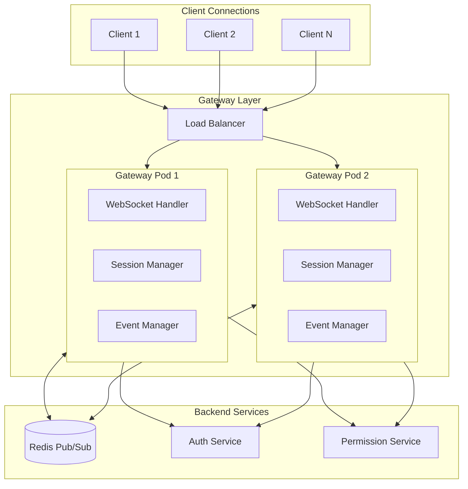
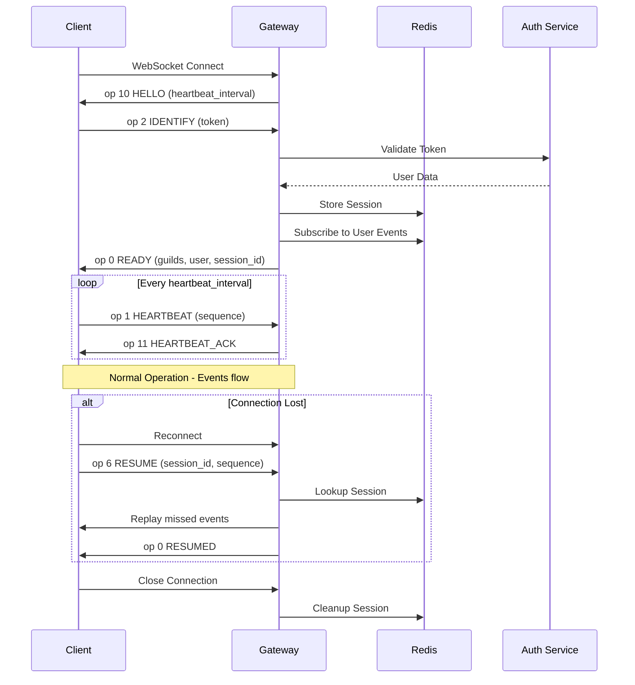
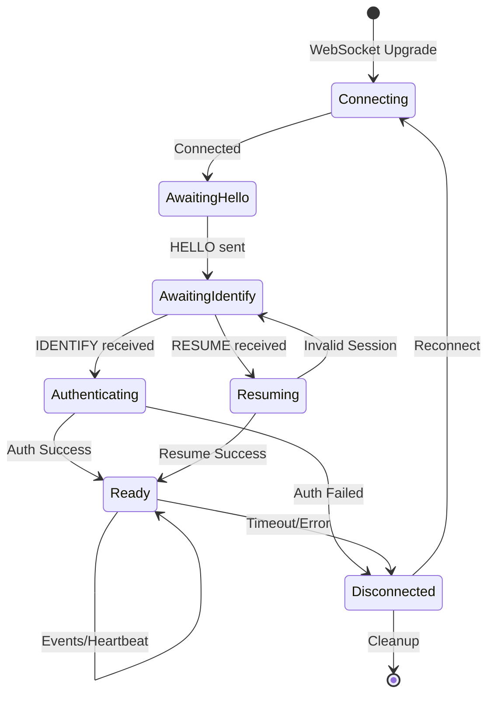
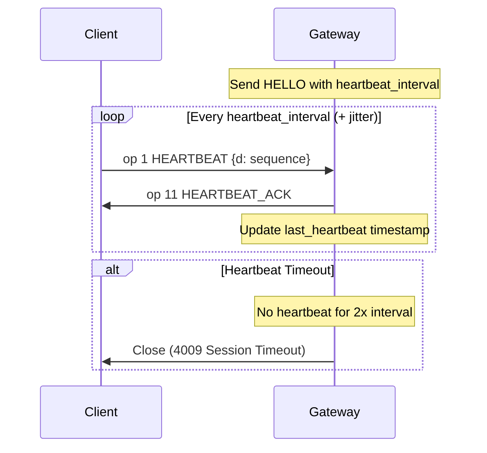
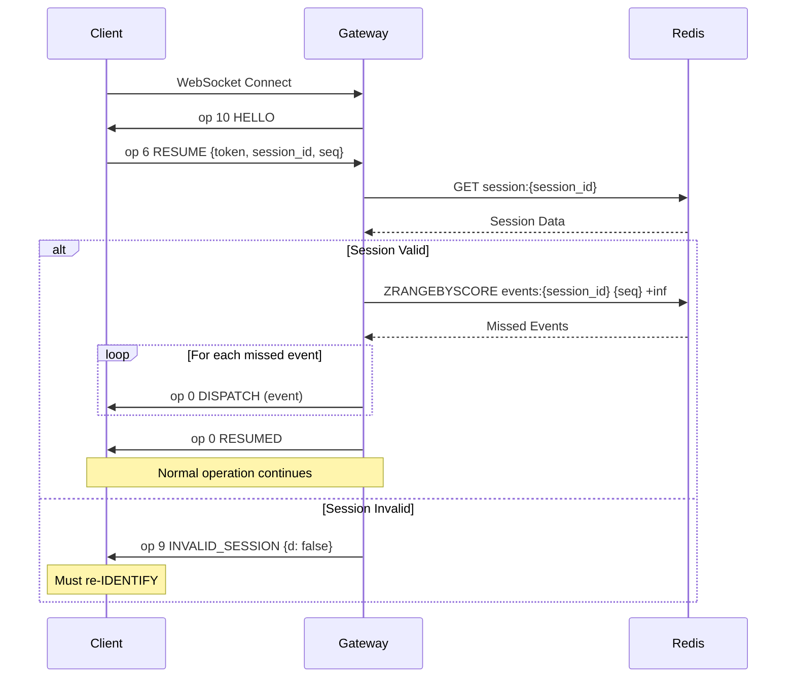

# WebSocket Gateway Design

> **Protocol Version**: 10
> **Encoding**: JSON / ETF
> **Last Updated**: 2025-12-17

---

## 목차 (Table of Contents)

- [1. Gateway 개요](#1-gateway-개요-overview)
- [2. 연결 수명주기](#2-연결-수명주기-connection-lifecycle)
- [3. Heartbeat 시스템](#3-heartbeat-시스템)
- [4. Resume 메커니즘](#4-resume-메커니즘)
- [5. Presence 시스템](#5-presence-시스템)
- [6. Typing Indicator](#6-typing-indicator-구현)
- [7. 이벤트 디스패치](#7-이벤트-디스패치-event-dispatch)
- [8. 연결 풀 관리](#8-연결-풀-관리-connection-pool)
- [9. Redis Pub/Sub](#9-redis-pubsub-통합)
- [10. 백프레셔 처리](#10-백프레셔-처리-backpressure)
- [11. 에러 처리](#11-에러-처리-error-handling)
- [12. 모니터링](#12-모니터링-monitoring)
- [13. 완전한 구현](#13-완전한-구현-예제)

---

## 1. Gateway 개요 (Overview)

### 1.1 What the Gateway Does

The WebSocket Gateway is responsible for:
- Real-time bidirectional communication with clients
- Connection management (lifecycle, heartbeat, resume)
- Event distribution to connected clients
- Presence and typing indicator management
- Rate limiting of gateway events

### 1.2 Discord Gateway Compatibility

| Feature | Discord | Our Implementation | Status |
|---------|---------|-------------------|--------|
| Opcodes 0-11 | ✅ | ✅ | Full |
| Heartbeat | ✅ | ✅ | Full |
| Resume | ✅ | ✅ | Full |
| Intents | ✅ | ✅ | Full |
| Compression | zlib-stream | zlib-stream | Full |
| Sharding | ✅ | ✅ | Full |
| ETF Encoding | ✅ | ❌ | JSON only |

### 1.3 Connection Architecture



---

## 2. 연결 수명주기 (Connection Lifecycle)

### 2.1 Connection Flow



### 2.2 Connection States



### 2.3 State Machine Implementation

```rust
// src/ws/session.rs
#[derive(Debug, Clone, PartialEq)]
pub enum SessionState {
    Connecting,
    AwaitingHello,
    AwaitingIdentify,
    Authenticating,
    Resuming,
    Ready,
    Disconnecting,
    Disconnected,
}

impl SessionState {
    pub fn can_receive(&self, opcode: u8) -> bool {
        match (self, opcode) {
            (SessionState::AwaitingIdentify, 2) => true,  // IDENTIFY
            (SessionState::AwaitingIdentify, 6) => true,  // RESUME
            (SessionState::Ready, 1) => true,              // HEARTBEAT
            (SessionState::Ready, 3) => true,              // PRESENCE_UPDATE
            (SessionState::Ready, 4) => true,              // VOICE_STATE_UPDATE
            (SessionState::Ready, 8) => true,              // REQUEST_GUILD_MEMBERS
            _ => false,
        }
    }

    pub fn transition(&mut self, event: StateEvent) -> Result<(), GatewayError> {
        let new_state = match (&self, event) {
            (SessionState::Connecting, StateEvent::Connected) => SessionState::AwaitingHello,
            (SessionState::AwaitingHello, StateEvent::HelloSent) => SessionState::AwaitingIdentify,
            (SessionState::AwaitingIdentify, StateEvent::IdentifyReceived) => SessionState::Authenticating,
            (SessionState::AwaitingIdentify, StateEvent::ResumeReceived) => SessionState::Resuming,
            (SessionState::Authenticating, StateEvent::AuthSuccess) => SessionState::Ready,
            (SessionState::Resuming, StateEvent::ResumeSuccess) => SessionState::Ready,
            (SessionState::Resuming, StateEvent::InvalidSession) => SessionState::AwaitingIdentify,
            (SessionState::Ready, StateEvent::Disconnect) => SessionState::Disconnecting,
            _ => return Err(GatewayError::InvalidStateTransition),
        };

        *self = new_state;
        Ok(())
    }
}
```

---

## 3. Heartbeat 시스템

### 3.1 Heartbeat Flow



### 3.2 Heartbeat Implementation

```rust
// src/ws/heartbeat.rs
use std::time::{Duration, Instant};
use tokio::time::interval;

pub struct HeartbeatManager {
    interval: Duration,
    last_heartbeat: Instant,
    last_ack: Instant,
    sequence: u64,
    missed_heartbeats: u32,
}

impl HeartbeatManager {
    pub fn new(interval_ms: u64) -> Self {
        let now = Instant::now();
        Self {
            interval: Duration::from_millis(interval_ms),
            last_heartbeat: now,
            last_ack: now,
            sequence: 0,
            missed_heartbeats: 0,
        }
    }

    pub fn record_heartbeat(&mut self, sequence: u64) {
        self.last_heartbeat = Instant::now();
        self.sequence = sequence;
    }

    pub fn record_ack(&mut self) {
        self.last_ack = Instant::now();
        self.missed_heartbeats = 0;
    }

    pub fn is_zombie(&self) -> bool {
        let timeout = self.interval * 2;
        self.last_heartbeat.elapsed() > timeout
    }

    pub fn check_timeout(&mut self) -> bool {
        if self.last_heartbeat.elapsed() > self.interval {
            self.missed_heartbeats += 1;
            return self.missed_heartbeats > 2;
        }
        false
    }

    pub fn get_latency(&self) -> Duration {
        if self.last_ack > self.last_heartbeat {
            Duration::ZERO
        } else {
            self.last_ack.elapsed()
        }
    }
}

// Heartbeat check task
pub async fn heartbeat_checker(
    session: Arc<RwLock<WsSession>>,
    mut shutdown_rx: broadcast::Receiver<()>,
) {
    let check_interval = Duration::from_secs(5);
    let mut ticker = interval(check_interval);

    loop {
        tokio::select! {
            _ = ticker.tick() => {
                let mut session = session.write().await;
                if session.heartbeat.is_zombie() {
                    tracing::warn!(
                        session_id = %session.session_id,
                        "Zombie connection detected, closing"
                    );
                    session.close(CloseCode::SessionTimeout).await;
                    break;
                }
            }
            _ = shutdown_rx.recv() => {
                break;
            }
        }
    }
}
```

### 3.3 Zombie Connection Detection

```rust
// Zombie detection criteria
pub fn detect_zombie_connections(sessions: &DashMap<String, Arc<RwLock<WsSession>>>) {
    let timeout = Duration::from_secs(90); // 1.5x normal interval

    for entry in sessions.iter() {
        let session = entry.value();
        if let Ok(session) = session.try_read() {
            if session.last_activity.elapsed() > timeout {
                tracing::warn!(
                    session_id = %session.session_id,
                    elapsed = ?session.last_activity.elapsed(),
                    "Zombie connection detected"
                );
                // Queue for cleanup
            }
        }
    }
}
```

---

## 4. Resume 메커니즘

### 4.1 Why Resume Exists

- **Network Interruptions**: Mobile networks, WiFi switches
- **Server Restarts**: Zero-downtime deployments
- **Load Balancer Failover**: Connection migration
- **No Missed Events**: Replay events since last sequence

### 4.2 Session Storage (Redis)

```rust
// src/ws/session_store.rs
use redis::AsyncCommands;
use serde::{Deserialize, Serialize};

#[derive(Debug, Serialize, Deserialize)]
pub struct StoredSession {
    pub session_id: String,
    pub user_id: i64,
    pub sequence: u64,
    pub guilds: Vec<i64>,
    pub created_at: i64,
    pub resume_gateway_url: String,
}

pub struct SessionStore {
    redis: redis::Client,
}

impl SessionStore {
    const SESSION_TTL: usize = 300; // 5 minutes
    const EVENT_BUFFER_SIZE: usize = 1000;

    pub async fn store_session(&self, session: &StoredSession) -> Result<(), RedisError> {
        let mut conn = self.redis.get_multiplexed_async_connection().await?;
        let key = format!("session:{}", session.session_id);

        conn.set_ex(
            &key,
            serde_json::to_string(session)?,
            Self::SESSION_TTL,
        ).await?;

        Ok(())
    }

    pub async fn get_session(&self, session_id: &str) -> Result<Option<StoredSession>, RedisError> {
        let mut conn = self.redis.get_multiplexed_async_connection().await?;
        let key = format!("session:{}", session_id);

        let data: Option<String> = conn.get(&key).await?;
        match data {
            Some(json) => Ok(Some(serde_json::from_str(&json)?)),
            None => Ok(None),
        }
    }

    pub async fn buffer_event(
        &self,
        session_id: &str,
        sequence: u64,
        event: &GatewayEvent,
    ) -> Result<(), RedisError> {
        let mut conn = self.redis.get_multiplexed_async_connection().await?;
        let key = format!("events:{}", session_id);

        // Store event with sequence as score
        conn.zadd(&key, serde_json::to_string(event)?, sequence as f64).await?;

        // Trim to max size
        conn.zremrangebyrank(&key, 0, -(Self::EVENT_BUFFER_SIZE as isize)).await?;

        // Set TTL
        conn.expire(&key, Self::SESSION_TTL).await?;

        Ok(())
    }

    pub async fn get_missed_events(
        &self,
        session_id: &str,
        since_sequence: u64,
    ) -> Result<Vec<GatewayEvent>, RedisError> {
        let mut conn = self.redis.get_multiplexed_async_connection().await?;
        let key = format!("events:{}", session_id);

        let events: Vec<String> = conn
            .zrangebyscore(&key, since_sequence as f64, "+inf")
            .await?;

        let parsed: Vec<GatewayEvent> = events
            .iter()
            .filter_map(|e| serde_json::from_str(e).ok())
            .collect();

        Ok(parsed)
    }
}
```

### 4.3 Resume Flow



### 4.4 Resume Handler

```rust
// src/ws/handlers/resume.rs
pub async fn handle_resume(
    session: &mut WsSession,
    payload: ResumePayload,
    session_store: &SessionStore,
) -> Result<(), GatewayError> {
    // Validate token
    let user_id = validate_token(&payload.token).await?;

    // Look up stored session
    let stored = session_store
        .get_session(&payload.session_id)
        .await?
        .ok_or(GatewayError::InvalidSession)?;

    // Verify session belongs to user
    if stored.user_id != user_id {
        return Err(GatewayError::InvalidSession);
    }

    // Check if session is too old
    let age = chrono::Utc::now().timestamp() - stored.created_at;
    if age > 300 {
        return Err(GatewayError::SessionExpired);
    }

    // Restore session state
    session.user_id = Some(user_id);
    session.session_id = payload.session_id.clone();
    session.guilds = stored.guilds;

    // Replay missed events
    let missed_events = session_store
        .get_missed_events(&payload.session_id, payload.seq)
        .await?;

    tracing::info!(
        session_id = %payload.session_id,
        missed_count = missed_events.len(),
        "Replaying missed events"
    );

    for event in missed_events {
        session.send_event(event).await?;
    }

    // Send RESUMED
    session.send(GatewayPayload {
        op: Opcode::Dispatch,
        d: Some(json!({})),
        s: Some(session.sequence),
        t: Some("RESUMED".to_string()),
    }).await?;

    Ok(())
}
```

---

## 5. Presence 시스템

### 5.1 Presence States

| State | Value | Description |
|-------|-------|-------------|
| `online` | 0 | User is active |
| `idle` | 1 | User is AFK (away from keyboard) |
| `dnd` | 2 | Do Not Disturb - no notifications |
| `invisible` | 3 | Appears offline to others |
| `offline` | 4 | User is disconnected |

### 5.2 Presence Update Flow

```rust
// src/ws/presence.rs
use dashmap::DashMap;
use std::sync::Arc;

#[derive(Debug, Clone, Serialize, Deserialize)]
pub struct UserPresence {
    pub user_id: i64,
    pub status: PresenceStatus,
    pub activities: Vec<Activity>,
    pub client_status: ClientStatus,
    pub last_updated: i64,
}

#[derive(Debug, Clone, Serialize, Deserialize)]
pub struct ClientStatus {
    pub desktop: Option<String>,
    pub mobile: Option<String>,
    pub web: Option<String>,
}

pub struct PresenceManager {
    /// User ID -> Presence
    presences: DashMap<i64, UserPresence>,
    /// Redis for cross-instance sync
    redis: Arc<redis::Client>,
}

impl PresenceManager {
    pub async fn update_presence(
        &self,
        user_id: i64,
        status: PresenceStatus,
        activities: Vec<Activity>,
    ) -> Result<(), GatewayError> {
        let presence = UserPresence {
            user_id,
            status,
            activities,
            client_status: ClientStatus::default(),
            last_updated: chrono::Utc::now().timestamp(),
        };

        // Update local cache
        self.presences.insert(user_id, presence.clone());

        // Sync to Redis
        let mut conn = self.redis.get_multiplexed_async_connection().await?;
        redis::cmd("HSET")
            .arg("presences")
            .arg(user_id.to_string())
            .arg(serde_json::to_string(&presence)?)
            .query_async(&mut conn)
            .await?;

        Ok(())
    }

    pub async fn get_guild_presences(
        &self,
        guild_id: i64,
        member_ids: &[i64],
    ) -> Vec<UserPresence> {
        member_ids
            .iter()
            .filter_map(|id| self.presences.get(id).map(|p| p.clone()))
            .collect()
    }

    pub async fn set_offline(&self, user_id: i64) -> Result<(), GatewayError> {
        self.update_presence(user_id, PresenceStatus::Offline, vec![]).await
    }
}
```

### 5.3 Presence Propagation

```rust
// Propagate presence updates to guilds
pub async fn propagate_presence_update(
    presence_manager: &PresenceManager,
    event_dispatcher: &EventDispatcher,
    user_id: i64,
    presence: &UserPresence,
) -> Result<(), GatewayError> {
    // Get user's guilds
    let user_guilds = get_user_guilds(user_id).await?;

    // For each guild, send PRESENCE_UPDATE to members who can see the user
    for guild_id in user_guilds {
        let event = GatewayEvent {
            op: Opcode::Dispatch,
            t: Some("PRESENCE_UPDATE".to_string()),
            d: json!({
                "user": { "id": user_id.to_string() },
                "guild_id": guild_id.to_string(),
                "status": presence.status,
                "activities": presence.activities,
                "client_status": presence.client_status,
            }),
        };

        event_dispatcher.dispatch_to_guild(guild_id, event).await?;
    }

    Ok(())
}
```

---

## 6. Typing Indicator 구현

### 6.1 Typing Start Event

```rust
// src/ws/handlers/typing.rs
pub async fn handle_typing_start(
    session: &WsSession,
    channel_id: i64,
    event_dispatcher: &EventDispatcher,
) -> Result<(), GatewayError> {
    let user_id = session.user_id.ok_or(GatewayError::NotAuthenticated)?;

    // Rate limit: max 1 typing event per 10 seconds per channel
    if !check_typing_rate_limit(user_id, channel_id).await? {
        return Ok(()); // Silently ignore
    }

    // Check permission
    check_channel_permission(user_id, channel_id, Permission::SEND_MESSAGES).await?;

    let event = GatewayEvent {
        op: Opcode::Dispatch,
        t: Some("TYPING_START".to_string()),
        d: json!({
            "channel_id": channel_id.to_string(),
            "guild_id": get_channel_guild(channel_id).await?.map(|g| g.to_string()),
            "user_id": user_id.to_string(),
            "timestamp": chrono::Utc::now().timestamp(),
        }),
    };

    event_dispatcher.dispatch_to_channel(channel_id, event).await?;

    Ok(())
}
```

### 6.2 Typing Expiration

```rust
// Typing indicators expire after 10 seconds
pub struct TypingManager {
    /// (channel_id, user_id) -> expiry_time
    typing: DashMap<(i64, i64), Instant>,
}

impl TypingManager {
    pub fn record_typing(&self, channel_id: i64, user_id: i64) {
        let expiry = Instant::now() + Duration::from_secs(10);
        self.typing.insert((channel_id, user_id), expiry);
    }

    pub fn is_typing(&self, channel_id: i64, user_id: i64) -> bool {
        self.typing
            .get(&(channel_id, user_id))
            .map(|exp| *exp > Instant::now())
            .unwrap_or(false)
    }

    pub fn cleanup_expired(&self) {
        let now = Instant::now();
        self.typing.retain(|_, expiry| *expiry > now);
    }

    pub fn get_typing_users(&self, channel_id: i64) -> Vec<i64> {
        let now = Instant::now();
        self.typing
            .iter()
            .filter(|entry| entry.key().0 == channel_id && *entry.value() > now)
            .map(|entry| entry.key().1)
            .collect()
    }
}
```

### 6.3 Debouncing Strategy

Client-side recommendations:
- Only send typing event when user actually types
- Debounce to max 1 event per 10 seconds
- Stop sending after 10 seconds of no typing

Server-side rate limiting:
```rust
pub async fn check_typing_rate_limit(user_id: i64, channel_id: i64) -> Result<bool, GatewayError> {
    let key = format!("typing_rate:{}:{}", user_id, channel_id);
    let mut conn = get_redis_conn().await?;

    // Allow 1 typing event per 8 seconds (slightly less than expiry)
    let set: bool = redis::cmd("SET")
        .arg(&key)
        .arg("1")
        .arg("NX")
        .arg("EX")
        .arg(8)
        .query_async(&mut conn)
        .await?;

    Ok(set)
}
```

---

## 7. 이벤트 디스패치 (Event Dispatch)

### 7.1 Event Types

| Event | Direction | Description |
|-------|-----------|-------------|
| `READY` | S→C | Initial state after IDENTIFY |
| `RESUMED` | S→C | Session resumed successfully |
| `GUILD_CREATE` | S→C | Guild data (lazy load) |
| `GUILD_UPDATE` | S→C | Guild settings changed |
| `GUILD_DELETE` | S→C | Left/kicked from guild |
| `CHANNEL_CREATE` | S→C | New channel created |
| `CHANNEL_UPDATE` | S→C | Channel modified |
| `CHANNEL_DELETE` | S→C | Channel deleted |
| `MESSAGE_CREATE` | S→C | New message |
| `MESSAGE_UPDATE` | S→C | Message edited |
| `MESSAGE_DELETE` | S→C | Message deleted |
| `PRESENCE_UPDATE` | S→C | User presence changed |
| `TYPING_START` | S→C | User started typing |

### 7.2 Event Routing

```rust
// src/ws/dispatcher.rs
pub struct EventDispatcher {
    /// Session ID -> Session sender channel
    sessions: Arc<DashMap<String, mpsc::Sender<GatewayEvent>>>,
    /// Channel ID -> Set of session IDs
    channel_subscriptions: Arc<DashMap<i64, HashSet<String>>>,
    /// Guild ID -> Set of session IDs
    guild_subscriptions: Arc<DashMap<i64, HashSet<String>>>,
    /// User ID -> Set of session IDs (for multi-device)
    user_sessions: Arc<DashMap<i64, HashSet<String>>>,
}

impl EventDispatcher {
    /// Dispatch event to all sessions in a channel
    pub async fn dispatch_to_channel(
        &self,
        channel_id: i64,
        event: GatewayEvent,
    ) -> Result<(), GatewayError> {
        if let Some(session_ids) = self.channel_subscriptions.get(&channel_id) {
            for session_id in session_ids.iter() {
                if let Some(sender) = self.sessions.get(session_id) {
                    let _ = sender.send(event.clone()).await;
                }
            }
        }
        Ok(())
    }

    /// Dispatch event to all sessions in a guild
    pub async fn dispatch_to_guild(
        &self,
        guild_id: i64,
        event: GatewayEvent,
    ) -> Result<(), GatewayError> {
        if let Some(session_ids) = self.guild_subscriptions.get(&guild_id) {
            for session_id in session_ids.iter() {
                if let Some(sender) = self.sessions.get(session_id) {
                    let _ = sender.send(event.clone()).await;
                }
            }
        }
        Ok(())
    }

    /// Dispatch event to specific user (all their sessions)
    pub async fn dispatch_to_user(
        &self,
        user_id: i64,
        event: GatewayEvent,
    ) -> Result<(), GatewayError> {
        if let Some(session_ids) = self.user_sessions.get(&user_id) {
            for session_id in session_ids.iter() {
                if let Some(sender) = self.sessions.get(session_id) {
                    let _ = sender.send(event.clone()).await;
                }
            }
        }
        Ok(())
    }

    /// Subscribe session to a channel
    pub fn subscribe_channel(&self, session_id: &str, channel_id: i64) {
        self.channel_subscriptions
            .entry(channel_id)
            .or_default()
            .insert(session_id.to_string());
    }

    /// Unsubscribe session from a channel
    pub fn unsubscribe_channel(&self, session_id: &str, channel_id: i64) {
        if let Some(mut sessions) = self.channel_subscriptions.get_mut(&channel_id) {
            sessions.remove(session_id);
        }
    }
}
```

### 7.3 Permission-based Event Filtering

```rust
// Filter events based on user permissions
pub async fn filter_event_for_user(
    event: &GatewayEvent,
    user_id: i64,
    permission_service: &PermissionService,
) -> Option<GatewayEvent> {
    match event.t.as_deref() {
        Some("MESSAGE_CREATE") | Some("MESSAGE_UPDATE") => {
            let channel_id = event.d["channel_id"].as_str()?.parse().ok()?;

            if !permission_service
                .has_permission(user_id, channel_id, Permission::VIEW_CHANNEL)
                .await
                .ok()?
            {
                return None;
            }

            Some(event.clone())
        }
        Some("PRESENCE_UPDATE") => {
            // Check if user shares a guild with the presence target
            let target_user_id = event.d["user"]["id"].as_str()?.parse().ok()?;

            if !shares_guild(user_id, target_user_id).await.ok()? {
                return None;
            }

            Some(event.clone())
        }
        _ => Some(event.clone()),
    }
}
```

---

## 8. 연결 풀 관리 (Connection Pool)

### 8.1 Connection Manager

```rust
// src/ws/connection_manager.rs
use dashmap::DashMap;
use std::sync::Arc;
use tokio::sync::mpsc;

pub struct ConnectionManager {
    /// Session ID -> Session handle
    sessions: Arc<DashMap<String, SessionHandle>>,
    /// User ID -> Set of session IDs
    user_sessions: Arc<DashMap<i64, HashSet<String>>>,
    /// Metrics
    metrics: ConnectionMetrics,
}

pub struct SessionHandle {
    pub session_id: String,
    pub user_id: i64,
    pub sender: mpsc::Sender<GatewayEvent>,
    pub created_at: Instant,
}

impl ConnectionManager {
    pub fn new() -> Self {
        Self {
            sessions: Arc::new(DashMap::new()),
            user_sessions: Arc::new(DashMap::new()),
            metrics: ConnectionMetrics::new(),
        }
    }

    pub fn register_session(&self, session: SessionHandle) {
        let session_id = session.session_id.clone();
        let user_id = session.user_id;

        self.sessions.insert(session_id.clone(), session);
        self.user_sessions
            .entry(user_id)
            .or_default()
            .insert(session_id);

        self.metrics.connections_active.inc();
        self.metrics.connections_total.inc();
    }

    pub fn unregister_session(&self, session_id: &str) {
        if let Some((_, session)) = self.sessions.remove(session_id) {
            if let Some(mut sessions) = self.user_sessions.get_mut(&session.user_id) {
                sessions.remove(session_id);
            }
            self.metrics.connections_active.dec();
        }
    }

    pub fn get_session(&self, session_id: &str) -> Option<SessionHandle> {
        self.sessions.get(session_id).map(|s| s.clone())
    }

    pub fn get_user_sessions(&self, user_id: i64) -> Vec<String> {
        self.user_sessions
            .get(&user_id)
            .map(|s| s.iter().cloned().collect())
            .unwrap_or_default()
    }

    pub fn connection_count(&self) -> usize {
        self.sessions.len()
    }
}
```

---

## 9. Redis Pub/Sub 통합

### 9.1 Topic Structure

| Topic Pattern | Purpose |
|---------------|---------|
| `gateway:guild:{guild_id}` | Guild-wide events |
| `gateway:channel:{channel_id}` | Channel-specific events |
| `gateway:user:{user_id}` | User-specific events (DMs) |
| `gateway:broadcast` | System-wide broadcasts |

### 9.2 Redis Subscription Handler

```rust
// src/ws/redis_subscriber.rs
pub struct RedisSubscriber {
    client: redis::Client,
    event_dispatcher: Arc<EventDispatcher>,
}

impl RedisSubscriber {
    pub async fn run(&self) -> Result<(), GatewayError> {
        let mut pubsub = self.client.get_async_pubsub().await?;

        // Subscribe to broadcast channel
        pubsub.psubscribe("gateway:*").await?;

        loop {
            let msg = pubsub.on_message().next().await;

            if let Some(msg) = msg {
                let channel: String = msg.get_channel()?;
                let payload: String = msg.get_payload()?;

                if let Ok(event) = serde_json::from_str::<GatewayEvent>(&payload) {
                    self.handle_redis_event(&channel, event).await?;
                }
            }
        }
    }

    async fn handle_redis_event(
        &self,
        channel: &str,
        event: GatewayEvent,
    ) -> Result<(), GatewayError> {
        if channel.starts_with("gateway:guild:") {
            let guild_id: i64 = channel
                .strip_prefix("gateway:guild:")
                .unwrap()
                .parse()?;
            self.event_dispatcher.dispatch_to_guild(guild_id, event).await?;
        } else if channel.starts_with("gateway:channel:") {
            let channel_id: i64 = channel
                .strip_prefix("gateway:channel:")
                .unwrap()
                .parse()?;
            self.event_dispatcher.dispatch_to_channel(channel_id, event).await?;
        } else if channel.starts_with("gateway:user:") {
            let user_id: i64 = channel
                .strip_prefix("gateway:user:")
                .unwrap()
                .parse()?;
            self.event_dispatcher.dispatch_to_user(user_id, event).await?;
        }

        Ok(())
    }
}
```

---

## 10. 백프레셔 처리 (Backpressure)

### 10.1 What is Backpressure

Backpressure occurs when:
- Client cannot receive events fast enough
- Internal message queues fill up
- Network congestion causes delays

### 10.2 Detection and Mitigation

```rust
// src/ws/backpressure.rs
pub struct BackpressureHandler {
    /// Max events in queue before applying backpressure
    queue_limit: usize,
    /// Max time to wait for send
    send_timeout: Duration,
}

impl BackpressureHandler {
    pub async fn send_with_backpressure(
        &self,
        sender: &mpsc::Sender<GatewayEvent>,
        event: GatewayEvent,
    ) -> Result<(), GatewayError> {
        // Check queue capacity
        if sender.capacity() == 0 {
            tracing::warn!("Backpressure detected, queue full");
            metrics::counter!("gateway_backpressure_events").increment(1);

            // Apply backpressure strategy
            match event.priority() {
                EventPriority::Critical => {
                    // Must send - wait
                    sender.send_timeout(event, self.send_timeout).await?;
                }
                EventPriority::Normal => {
                    // Try to send, drop if queue still full
                    if sender.try_send(event).is_err() {
                        metrics::counter!("gateway_dropped_events").increment(1);
                    }
                }
                EventPriority::Low => {
                    // Drop immediately if backpressure
                    metrics::counter!("gateway_dropped_events").increment(1);
                }
            }
        } else {
            sender.send(event).await?;
        }

        Ok(())
    }
}

impl GatewayEvent {
    pub fn priority(&self) -> EventPriority {
        match self.t.as_deref() {
            Some("READY") | Some("RESUMED") => EventPriority::Critical,
            Some("MESSAGE_CREATE") | Some("MESSAGE_UPDATE") => EventPriority::Normal,
            Some("TYPING_START") | Some("PRESENCE_UPDATE") => EventPriority::Low,
            _ => EventPriority::Normal,
        }
    }
}
```

---

## 11. 에러 처리 (Error Handling)

### 11.1 Close Codes

| Code | Name | Description | Reconnect? |
|------|------|-------------|------------|
| 4000 | Unknown Error | Unknown error | Yes |
| 4001 | Unknown Opcode | Invalid opcode | Yes |
| 4002 | Decode Error | Invalid payload | Yes |
| 4003 | Not Authenticated | Sent payload before IDENTIFY | Yes |
| 4004 | Authentication Failed | Invalid token | No |
| 4005 | Already Authenticated | Sent IDENTIFY twice | Yes |
| 4007 | Invalid Seq | Invalid sequence on RESUME | Yes |
| 4008 | Rate Limited | Too many payloads | Yes (after delay) |
| 4009 | Session Timeout | Session timed out | Yes (new session) |
| 4010 | Invalid Shard | Invalid shard config | No |
| 4011 | Sharding Required | Too many guilds | No |
| 4012 | Invalid API Version | Invalid gateway version | No |
| 4013 | Invalid Intents | Invalid intents | No |
| 4014 | Disallowed Intents | Unprivileged intents | No |

### 11.2 Error Recovery

```rust
// src/ws/error.rs
impl WsSession {
    pub async fn close(&mut self, code: CloseCode) -> Result<(), GatewayError> {
        let frame = CloseFrame {
            code: code.into(),
            reason: code.reason().into(),
        };

        self.ws_sender
            .send(Message::Close(Some(frame)))
            .await?;

        self.state = SessionState::Disconnected;
        Ok(())
    }
}

pub enum CloseCode {
    UnknownError = 4000,
    UnknownOpcode = 4001,
    DecodeError = 4002,
    NotAuthenticated = 4003,
    AuthenticationFailed = 4004,
    AlreadyAuthenticated = 4005,
    InvalidSeq = 4007,
    RateLimited = 4008,
    SessionTimeout = 4009,
    InvalidShard = 4010,
    ShardingRequired = 4011,
    InvalidAPIVersion = 4012,
    InvalidIntents = 4013,
    DisallowedIntents = 4014,
}

impl CloseCode {
    pub fn reason(&self) -> &'static str {
        match self {
            Self::UnknownError => "Unknown error",
            Self::UnknownOpcode => "Unknown opcode",
            Self::DecodeError => "Decode error",
            Self::NotAuthenticated => "Not authenticated",
            Self::AuthenticationFailed => "Authentication failed",
            Self::AlreadyAuthenticated => "Already authenticated",
            Self::InvalidSeq => "Invalid sequence",
            Self::RateLimited => "Rate limited",
            Self::SessionTimeout => "Session timeout",
            Self::InvalidShard => "Invalid shard",
            Self::ShardingRequired => "Sharding required",
            Self::InvalidAPIVersion => "Invalid API version",
            Self::InvalidIntents => "Invalid intents",
            Self::DisallowedIntents => "Disallowed intents",
        }
    }

    pub fn can_reconnect(&self) -> bool {
        !matches!(
            self,
            Self::AuthenticationFailed
                | Self::InvalidShard
                | Self::ShardingRequired
                | Self::InvalidAPIVersion
                | Self::InvalidIntents
                | Self::DisallowedIntents
        )
    }
}
```

---

## 12. 모니터링 (Monitoring)

### 12.1 Key Metrics

```rust
// src/ws/metrics.rs
use metrics::{counter, gauge, histogram};

pub struct GatewayMetrics;

impl GatewayMetrics {
    pub fn record_connection() {
        counter!("gateway_connections_total").increment(1);
        gauge!("gateway_connections_active").increment(1.0);
    }

    pub fn record_disconnection() {
        gauge!("gateway_connections_active").decrement(1.0);
    }

    pub fn record_event_sent(event_type: &str) {
        counter!("gateway_events_sent", "type" => event_type.to_string()).increment(1);
    }

    pub fn record_event_received(opcode: u8) {
        counter!("gateway_events_received", "opcode" => opcode.to_string()).increment(1);
    }

    pub fn record_heartbeat_latency(latency_ms: f64) {
        histogram!("gateway_heartbeat_latency_ms").record(latency_ms);
    }

    pub fn record_message_queue_size(size: usize) {
        gauge!("gateway_message_queue_size").set(size as f64);
    }
}
```

---

## 13. 완전한 구현 예제

### 13.1 WsSession Complete

```rust
// src/ws/session.rs
pub struct WsSession {
    pub session_id: String,
    pub user_id: Option<i64>,
    pub state: SessionState,
    pub ws_sender: SplitSink<WebSocketStream<TcpStream>, Message>,
    pub sequence: AtomicU64,
    pub heartbeat: HeartbeatManager,
    pub guilds: Vec<i64>,
    pub intents: u32,
    pub shard: Option<(u32, u32)>,
    pub created_at: Instant,
    pub last_activity: Instant,
}

impl WsSession {
    pub fn new(ws_sender: SplitSink<WebSocketStream<TcpStream>, Message>) -> Self {
        Self {
            session_id: uuid::Uuid::new_v4().to_string(),
            user_id: None,
            state: SessionState::Connecting,
            ws_sender,
            sequence: AtomicU64::new(0),
            heartbeat: HeartbeatManager::new(41250),
            guilds: Vec::new(),
            intents: 0,
            shard: None,
            created_at: Instant::now(),
            last_activity: Instant::now(),
        }
    }

    pub async fn send(&mut self, payload: GatewayPayload) -> Result<(), GatewayError> {
        let json = serde_json::to_string(&payload)?;
        self.ws_sender.send(Message::Text(json)).await?;
        self.last_activity = Instant::now();
        Ok(())
    }

    pub async fn send_event(&mut self, event: GatewayEvent) -> Result<(), GatewayError> {
        let seq = self.sequence.fetch_add(1, Ordering::SeqCst);

        let payload = GatewayPayload {
            op: Opcode::Dispatch,
            d: Some(event.d),
            s: Some(seq),
            t: event.t,
        };

        self.send(payload).await
    }

    pub fn next_sequence(&self) -> u64 {
        self.sequence.load(Ordering::SeqCst)
    }
}
```

### 13.2 Gateway Handler

```rust
// src/ws/gateway.rs
pub async fn ws_handler(
    ws: WebSocketUpgrade,
    State(state): State<AppState>,
) -> impl IntoResponse {
    ws.on_upgrade(|socket| handle_socket(socket, state))
}

async fn handle_socket(socket: WebSocket, state: AppState) {
    let (sender, mut receiver) = socket.split();

    // Create session
    let mut session = WsSession::new(sender);

    // Send HELLO
    session.send(GatewayPayload {
        op: Opcode::Hello,
        d: Some(json!({ "heartbeat_interval": 41250 })),
        s: None,
        t: None,
    }).await.ok();

    session.state = SessionState::AwaitingIdentify;

    // Event channel for internal dispatch
    let (event_tx, mut event_rx) = mpsc::channel::<GatewayEvent>(100);

    // Main event loop
    loop {
        tokio::select! {
            // Handle incoming WebSocket messages
            Some(msg) = receiver.next() => {
                match msg {
                    Ok(Message::Text(text)) => {
                        if let Ok(payload) = serde_json::from_str::<GatewayPayload>(&text) {
                            handle_gateway_payload(&mut session, payload, &state).await;
                        }
                    }
                    Ok(Message::Close(_)) => break,
                    Err(_) => break,
                    _ => {}
                }
            }

            // Handle internal events to dispatch
            Some(event) = event_rx.recv() => {
                if session.send_event(event).await.is_err() {
                    break;
                }
            }

            // Heartbeat timeout check
            _ = tokio::time::sleep(Duration::from_secs(5)) => {
                if session.heartbeat.is_zombie() {
                    session.close(CloseCode::SessionTimeout).await.ok();
                    break;
                }
            }
        }
    }

    // Cleanup
    if let Some(user_id) = session.user_id {
        state.presence_manager.set_offline(user_id).await.ok();
        state.connection_manager.unregister_session(&session.session_id);
    }
}

async fn handle_gateway_payload(
    session: &mut WsSession,
    payload: GatewayPayload,
    state: &AppState,
) {
    match payload.op {
        Opcode::Heartbeat => {
            if let Some(seq) = payload.d.and_then(|d| d.as_u64()) {
                session.heartbeat.record_heartbeat(seq);
                session.send(GatewayPayload {
                    op: Opcode::HeartbeatAck,
                    d: None,
                    s: None,
                    t: None,
                }).await.ok();
            }
        }
        Opcode::Identify => {
            handle_identify(session, payload.d, state).await;
        }
        Opcode::Resume => {
            handle_resume(session, payload.d, state).await;
        }
        Opcode::PresenceUpdate => {
            handle_presence_update(session, payload.d, state).await;
        }
        _ => {}
    }
}

pub fn router() -> Router<AppState> {
    Router::new().route("/gateway", get(ws_handler))
}
```

---

*This document provides the complete WebSocket Gateway implementation guide.*
