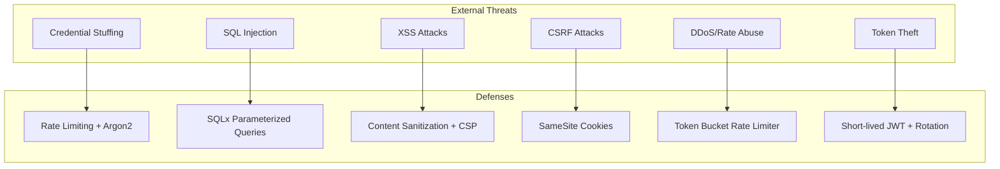
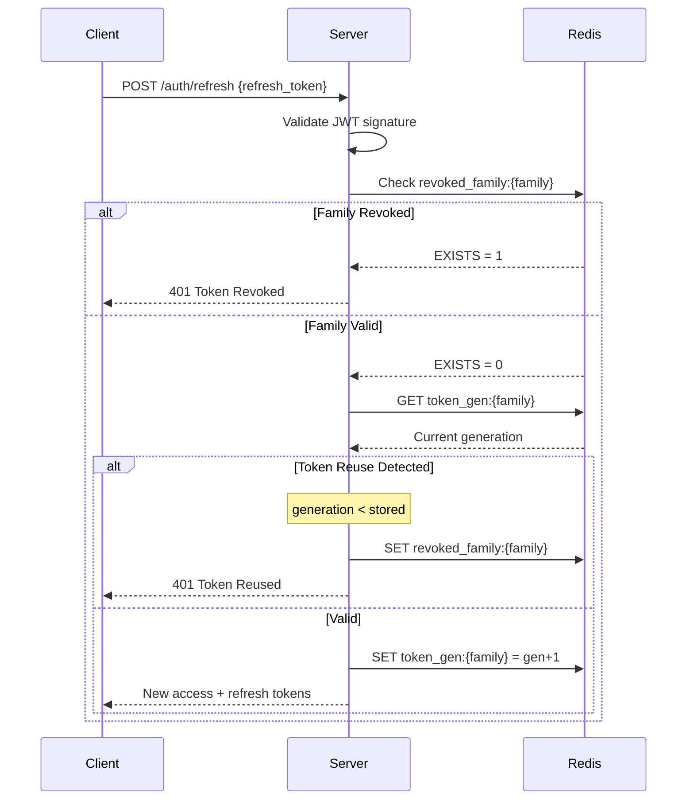

# Security & Authentication Guide

> **Security Level**: Production-grade
> **Last Updated**: 2025-12-17

---

## 목차 (Table of Contents)

- [1. 보안 개요](#1-보안-개요-security-overview)
- [2. JWT 인증](#2-jwt-인증-jwt-authentication)
- [3. Password 보안](#3-password-보안)
- [4. CORS 설정](#4-cors-설정)
- [5. CSRF 방어](#5-csrf-방어)
- [6. Rate Limiting](#6-rate-limiting)
- [7. Input Validation](#7-input-validation)
- [8. SQL Injection 방어](#8-sql-injection-방어)
- [9. XSS 방어](#9-xss-방어)
- [10. TLS 설정](#10-tls-설정)
- [11. 민감 데이터 처리](#11-민감-데이터-처리)
- [12. 권한 시스템](#12-권한-시스템-permissions)
- [13. 보안 헤더](#13-보안-헤더-security-headers)
- [14. 감사 로깅](#14-감사-로깅-audit-logging)
- [15. 보안 체크리스트](#15-보안-체크리스트)

---

## 1. 보안 개요 (Security Overview)

### 1.1 Security Principles

| Principle | Implementation |
|-----------|----------------|
| **Defense in Depth** | Multiple security layers |
| **Least Privilege** | Minimal required permissions |
| **Fail Secure** | Deny by default |
| **Secure by Default** | Safe configuration out of box |

### 1.2 Threat Model



---

## 2. JWT 인증 (JWT Authentication)

### 2.1 Token Architecture

| Token Type | Lifetime | Storage | Purpose |
|------------|----------|---------|---------|
| Access Token | 15 minutes | Memory only | API authentication |
| Refresh Token | 7 days | HttpOnly cookie | Token renewal |

### 2.2 Access Token Implementation

```rust
// src/auth/jwt.rs
use jsonwebtoken::{encode, decode, Header, Algorithm, Validation, EncodingKey, DecodingKey};
use serde::{Deserialize, Serialize};
use chrono::{Utc, Duration};

#[derive(Debug, Serialize, Deserialize)]
pub struct AccessTokenClaims {
    pub sub: String,        // User ID
    pub sid: String,        // Session ID
    pub iat: i64,           // Issued at
    pub exp: i64,           // Expiration
    pub jti: String,        // JWT ID (for revocation)
}

pub struct JwtService {
    encoding_key: EncodingKey,
    decoding_key: DecodingKey,
    access_token_duration: Duration,
    refresh_token_duration: Duration,
}

impl JwtService {
    pub fn new(secret: &str) -> Self {
        Self {
            encoding_key: EncodingKey::from_secret(secret.as_bytes()),
            decoding_key: DecodingKey::from_secret(secret.as_bytes()),
            access_token_duration: Duration::minutes(15),
            refresh_token_duration: Duration::days(7),
        }
    }

    pub fn generate_access_token(&self, user_id: i64, session_id: &str) -> Result<String, AuthError> {
        let now = Utc::now();
        let claims = AccessTokenClaims {
            sub: user_id.to_string(),
            sid: session_id.to_string(),
            iat: now.timestamp(),
            exp: (now + self.access_token_duration).timestamp(),
            jti: uuid::Uuid::new_v4().to_string(),
        };

        encode(&Header::new(Algorithm::HS256), &claims, &self.encoding_key)
            .map_err(|e| AuthError::TokenGeneration(e.to_string()))
    }

    pub fn validate_access_token(&self, token: &str) -> Result<AccessTokenClaims, AuthError> {
        let mut validation = Validation::new(Algorithm::HS256);
        validation.validate_exp = true;
        validation.leeway = 0;

        decode::<AccessTokenClaims>(token, &self.decoding_key, &validation)
            .map(|data| data.claims)
            .map_err(|e| match e.kind() {
                jsonwebtoken::errors::ErrorKind::ExpiredSignature => {
                    AuthError::TokenExpired
                }
                _ => AuthError::TokenInvalid(e.to_string()),
            })
    }
}
```

### 2.3 Refresh Token with Rotation

```rust
#[derive(Debug, Serialize, Deserialize)]
pub struct RefreshTokenClaims {
    pub sub: String,
    pub sid: String,
    pub family: String,     // Token family for rotation
    pub generation: u32,    // Current generation in family
    pub iat: i64,
    pub exp: i64,
}

impl JwtService {
    pub async fn refresh_tokens(
        &self,
        refresh_token: &str,
        redis: &redis::Client,
    ) -> Result<TokenPair, AuthError> {
        let claims = self.validate_refresh_token(refresh_token)?;

        // Check if token is in blacklist (family revoked)
        let mut conn = redis.get_multiplexed_async_connection().await?;
        let family_revoked: bool = redis::cmd("EXISTS")
            .arg(format!("revoked_family:{}", claims.family))
            .query_async(&mut conn)
            .await?;

        if family_revoked {
            return Err(AuthError::TokenRevoked);
        }

        // Check generation (detect token reuse)
        let stored_gen: Option<u32> = redis::cmd("GET")
            .arg(format!("token_gen:{}", claims.family))
            .query_async(&mut conn)
            .await?;

        if let Some(gen) = stored_gen {
            if claims.generation < gen {
                // Token reuse detected! Revoke entire family
                redis::cmd("SETEX")
                    .arg(format!("revoked_family:{}", claims.family))
                    .arg(604800) // 7 days
                    .arg("1")
                    .query_async(&mut conn)
                    .await?;

                return Err(AuthError::TokenReused);
            }
        }

        // Issue new tokens with incremented generation
        let user_id: i64 = claims.sub.parse()?;
        let new_generation = claims.generation + 1;

        // Store new generation
        redis::cmd("SETEX")
            .arg(format!("token_gen:{}", claims.family))
            .arg(604800)
            .arg(new_generation)
            .query_async(&mut conn)
            .await?;

        let access_token = self.generate_access_token(user_id, &claims.sid)?;
        let refresh_token = self.generate_refresh_token(user_id, &claims.sid, &claims.family, new_generation)?;

        Ok(TokenPair {
            access_token,
            refresh_token,
            expires_in: 900,
        })
    }
}
```

### 2.4 Token Refresh Flow



---

## 3. Password 보안

### 3.1 Password Policy

| Requirement | Value | Rationale |
|-------------|-------|-----------|
| Minimum length | 8 characters | NIST recommendation |
| Maximum length | 128 characters | DoS prevention |
| Character classes | 3 of 4 (upper, lower, digit, special) | Entropy |
| Common passwords | Rejected | Top 10K list |
| Breached passwords | Rejected | HaveIBeenPwned API |

### 3.2 Argon2 Implementation

```rust
// src/auth/password.rs
use argon2::{
    password_hash::{
        rand_core::OsRng,
        PasswordHash, PasswordHasher, PasswordVerifier, SaltString
    },
    Argon2, Params, Algorithm, Version,
};

pub struct PasswordService {
    argon2: Argon2<'static>,
}

impl PasswordService {
    pub fn new() -> Self {
        // OWASP recommended parameters for Argon2id
        let params = Params::new(
            65536,  // 64 MB memory
            3,      // 3 iterations
            4,      // 4 parallel lanes
            Some(32), // 32 byte output
        ).expect("Invalid Argon2 params");

        Self {
            argon2: Argon2::new(Algorithm::Argon2id, Version::V0x13, params),
        }
    }

    pub fn hash_password(&self, password: &str) -> Result<String, PasswordError> {
        let salt = SaltString::generate(&mut OsRng);
        let hash = self.argon2
            .hash_password(password.as_bytes(), &salt)
            .map_err(|e| PasswordError::HashingFailed(e.to_string()))?;
        Ok(hash.to_string())
    }

    pub fn verify_password(&self, password: &str, hash: &str) -> Result<bool, PasswordError> {
        let parsed_hash = PasswordHash::new(hash)
            .map_err(|e| PasswordError::InvalidHash(e.to_string()))?;

        Ok(self.argon2
            .verify_password(password.as_bytes(), &parsed_hash)
            .is_ok())
    }
}

// CPU-intensive work should be offloaded
pub async fn hash_password_async(password: String) -> Result<String, PasswordError> {
    tokio::task::spawn_blocking(move || {
        PasswordService::new().hash_password(&password)
    })
    .await
    .map_err(|_| PasswordError::TaskFailed)?
}
```

### 3.3 Password Validation

```rust
use validator::Validate;
use lazy_static::lazy_static;
use std::collections::HashSet;

lazy_static! {
    static ref COMMON_PASSWORDS: HashSet<&'static str> = {
        include_str!("../data/common-passwords.txt")
            .lines()
            .collect()
    };
}

#[derive(Debug, Validate)]
pub struct PasswordRequest {
    #[validate(custom = "validate_password")]
    pub password: String,
}

fn validate_password(password: &str) -> Result<(), validator::ValidationError> {
    // Length check
    if password.len() < 8 {
        return Err(validator::ValidationError::new("password_too_short"));
    }
    if password.len() > 128 {
        return Err(validator::ValidationError::new("password_too_long"));
    }

    // Character class check
    let has_upper = password.chars().any(|c| c.is_ascii_uppercase());
    let has_lower = password.chars().any(|c| c.is_ascii_lowercase());
    let has_digit = password.chars().any(|c| c.is_ascii_digit());
    let has_special = password.chars().any(|c| !c.is_alphanumeric());

    let classes = [has_upper, has_lower, has_digit, has_special]
        .iter()
        .filter(|&&x| x)
        .count();

    if classes < 3 {
        return Err(validator::ValidationError::new("password_weak"));
    }

    // Common password check
    if COMMON_PASSWORDS.contains(password.to_lowercase().as_str()) {
        return Err(validator::ValidationError::new("password_common"));
    }

    Ok(())
}
```

---

## 4. CORS 설정

```rust
// src/api/middleware/cors.rs
use tower_http::cors::{CorsLayer, Any};
use axum::http::{HeaderValue, Method};

pub fn cors_layer(config: &Settings) -> CorsLayer {
    let origins = if config.environment == "production" {
        // Production: explicit origins only
        config.allowed_origins
            .iter()
            .map(|o| o.parse::<HeaderValue>().unwrap())
            .collect::<Vec<_>>()
    } else {
        // Development: allow localhost
        vec![
            "http://localhost:3000".parse().unwrap(),
            "http://localhost:5173".parse().unwrap(),
        ]
    };

    CorsLayer::new()
        .allow_origin(origins)
        .allow_methods([
            Method::GET,
            Method::POST,
            Method::PUT,
            Method::PATCH,
            Method::DELETE,
            Method::OPTIONS,
        ])
        .allow_headers([
            axum::http::header::AUTHORIZATION,
            axum::http::header::CONTENT_TYPE,
            axum::http::header::ACCEPT,
        ])
        .allow_credentials(true)
        .max_age(Duration::from_secs(3600))
}
```

---

## 5. CSRF 방어

```rust
// For SPA: Use SameSite cookies + custom header verification
use axum::http::header::HeaderName;

const CSRF_HEADER: HeaderName = HeaderName::from_static("x-csrf-token");

pub async fn csrf_middleware(
    State(state): State<AppState>,
    request: Request,
    next: Next,
) -> Result<Response, AppError> {
    // Skip for safe methods
    if request.method().is_safe() {
        return Ok(next.run(request).await);
    }

    // Verify custom header exists (double submit pattern)
    if request.headers().get(CSRF_HEADER).is_none() {
        return Err(AppError::Forbidden("Missing CSRF token".to_string()));
    }

    // For cookie-based sessions, verify token matches
    if let Some(cookie_token) = extract_csrf_cookie(&request) {
        if let Some(header_token) = request.headers().get(CSRF_HEADER) {
            if cookie_token != header_token.to_str().unwrap_or("") {
                return Err(AppError::Forbidden("CSRF token mismatch".to_string()));
            }
        }
    }

    Ok(next.run(request).await)
}
```

---

## 6. Rate Limiting

### 6.1 Token Bucket Implementation

```rust
// src/security/rate_limit.rs
use std::sync::Arc;
use dashmap::DashMap;
use std::time::{Duration, Instant};

pub struct TokenBucket {
    tokens: f64,
    max_tokens: f64,
    refill_rate: f64,  // tokens per second
    last_update: Instant,
}

impl TokenBucket {
    pub fn new(max_tokens: f64, refill_rate: f64) -> Self {
        Self {
            tokens: max_tokens,
            max_tokens,
            refill_rate,
            last_update: Instant::now(),
        }
    }

    pub fn try_acquire(&mut self) -> bool {
        self.refill();

        if self.tokens >= 1.0 {
            self.tokens -= 1.0;
            true
        } else {
            false
        }
    }

    pub fn time_until_available(&self) -> Duration {
        if self.tokens >= 1.0 {
            Duration::ZERO
        } else {
            let needed = 1.0 - self.tokens;
            Duration::from_secs_f64(needed / self.refill_rate)
        }
    }

    fn refill(&mut self) {
        let now = Instant::now();
        let elapsed = now.duration_since(self.last_update).as_secs_f64();
        self.tokens = (self.tokens + elapsed * self.refill_rate).min(self.max_tokens);
        self.last_update = now;
    }
}

pub struct RateLimiter {
    buckets: DashMap<String, TokenBucket>,
    config: RateLimitConfig,
}

#[derive(Clone)]
pub struct RateLimitConfig {
    pub default_max: f64,
    pub default_rate: f64,
    pub endpoint_limits: std::collections::HashMap<String, (f64, f64)>,
}

impl RateLimiter {
    pub fn check(&self, key: &str, endpoint: &str) -> Result<(), (u64, String)> {
        let (max, rate) = self.config.endpoint_limits
            .get(endpoint)
            .copied()
            .unwrap_or((self.config.default_max, self.config.default_rate));

        let mut bucket = self.buckets
            .entry(format!("{}:{}", key, endpoint))
            .or_insert_with(|| TokenBucket::new(max, rate));

        if bucket.try_acquire() {
            Ok(())
        } else {
            let retry_after = bucket.time_until_available().as_secs();
            Err((retry_after, "Rate limit exceeded".to_string()))
        }
    }
}
```

### 6.2 Endpoint-specific Limits

```rust
let config = RateLimitConfig {
    default_max: 60.0,
    default_rate: 1.0,
    endpoint_limits: [
        ("/api/auth/login".to_string(), (5.0, 0.1)),        // 5 requests, 1 per 10s
        ("/api/auth/register".to_string(), (3.0, 0.05)),   // 3 requests, 1 per 20s
        ("/api/channels/*/messages".to_string(), (5.0, 1.0)), // 5 msg/s
    ].into_iter().collect(),
};
```

---

## 7. Input Validation

```rust
// src/validation/mod.rs
use validator::Validate;
use serde::Deserialize;
use regex::Regex;
use lazy_static::lazy_static;

lazy_static! {
    static ref USERNAME_REGEX: Regex = Regex::new(r"^[a-zA-Z0-9_]{2,32}$").unwrap();
    static ref CHANNEL_NAME_REGEX: Regex = Regex::new(r"^[a-z0-9-]{1,100}$").unwrap();
}

#[derive(Debug, Deserialize, Validate)]
pub struct CreateChannelRequest {
    #[validate(regex(path = "CHANNEL_NAME_REGEX", message = "Invalid channel name"))]
    pub name: String,

    #[validate(length(max = 1024))]
    pub topic: Option<String>,

    #[validate(range(min = 0, max = 21600))]
    pub rate_limit_per_user: Option<u32>,
}

#[derive(Debug, Deserialize, Validate)]
pub struct CreateMessageRequest {
    #[validate(length(max = 2000, message = "Message too long"))]
    pub content: Option<String>,

    #[validate(length(max = 10))]
    pub embeds: Option<Vec<Embed>>,

    #[validate]
    pub message_reference: Option<MessageReference>,
}

// Validation extractor
pub struct ValidatedJson<T>(pub T);

#[async_trait]
impl<T, S> FromRequest<S> for ValidatedJson<T>
where
    T: DeserializeOwned + Validate,
    S: Send + Sync,
{
    type Rejection = AppError;

    async fn from_request(req: Request, state: &S) -> Result<Self, Self::Rejection> {
        let Json(value) = Json::<T>::from_request(req, state)
            .await
            .map_err(|e| AppError::BadRequest(e.to_string()))?;

        value.validate()
            .map_err(|e| AppError::ValidationError(e.to_string()))?;

        Ok(ValidatedJson(value))
    }
}
```

---

## 8. SQL Injection 방어

### 8.1 Safe Patterns (SQLx)

```rust
// ✅ GOOD: Parameterized queries with compile-time verification
let user = sqlx::query_as!(
    User,
    "SELECT * FROM users WHERE id = $1 AND deleted_at IS NULL",
    user_id
)
.fetch_optional(pool)
.await?;

// ✅ GOOD: Dynamic WHERE with query builder
pub async fn search_users(
    pool: &PgPool,
    username: Option<&str>,
    email: Option<&str>,
) -> Result<Vec<User>, sqlx::Error> {
    let mut query = "SELECT * FROM users WHERE deleted_at IS NULL".to_string();
    let mut args = vec![];

    if let Some(u) = username {
        query.push_str(" AND username ILIKE $1");
        args.push(format!("%{}%", u));
    }

    if let Some(e) = email {
        let idx = args.len() + 1;
        query.push_str(&format!(" AND email = ${}", idx));
        args.push(e.to_string());
    }

    sqlx::query_as::<_, User>(&query)
        .bind_all(args)
        .fetch_all(pool)
        .await
}
```

### 8.2 Dangerous Patterns (NEVER DO)

```rust
// ❌ BAD: String interpolation
let query = format!("SELECT * FROM users WHERE id = {}", user_id);

// ❌ BAD: Concatenation
let query = "SELECT * FROM users WHERE name = '".to_string() + name + "'";
```

---

## 9. XSS 방어

```rust
// Content sanitization
use ammonia::Builder;

pub fn sanitize_html(input: &str) -> String {
    Builder::default()
        .tags(hashset!["b", "i", "u", "code", "pre", "a"])
        .url_schemes(hashset!["http", "https"])
        .link_rel(Some("noopener noreferrer"))
        .clean(input)
        .to_string()
}

// CSP Header
pub fn security_headers_layer() -> SetResponseHeaderLayer<HeaderValue> {
    SetResponseHeaderLayer::overriding(
        header::CONTENT_SECURITY_POLICY,
        HeaderValue::from_static(
            "default-src 'self'; \
             script-src 'self'; \
             style-src 'self' 'unsafe-inline'; \
             img-src 'self' data: https:; \
             connect-src 'self' wss:; \
             frame-ancestors 'none';"
        ),
    )
}
```

---

## 10. TLS 설정

```rust
// rustls configuration
use rustls::{Certificate, PrivateKey, ServerConfig};
use std::fs::File;
use std::io::BufReader;

pub fn configure_tls(cert_path: &str, key_path: &str) -> ServerConfig {
    let cert_file = File::open(cert_path).expect("Cannot open certificate");
    let key_file = File::open(key_path).expect("Cannot open private key");

    let certs = rustls_pemfile::certs(&mut BufReader::new(cert_file))
        .expect("Cannot parse certificate")
        .into_iter()
        .map(Certificate)
        .collect();

    let key = rustls_pemfile::private_key(&mut BufReader::new(key_file))
        .expect("Cannot parse private key")
        .expect("No private key found")
        .into();

    ServerConfig::builder()
        .with_safe_defaults()
        .with_no_client_auth()
        .with_single_cert(certs, key)
        .expect("Invalid certificate/key")
}
```

---

## 11. 민감 데이터 처리

```rust
// Never log sensitive data
#[derive(Debug)]
pub struct SensitiveString(String);

impl std::fmt::Display for SensitiveString {
    fn fmt(&self, f: &mut std::fmt::Formatter<'_>) -> std::fmt::Result {
        write!(f, "[REDACTED]")
    }
}

// Response filtering - never expose these fields
#[derive(Serialize)]
pub struct UserResponse {
    pub id: String,
    pub username: String,
    // password_hash - NEVER include
    // email - only include for @me
    #[serde(skip_serializing_if = "Option::is_none")]
    pub email: Option<String>,
}
```

---

## 12. 권한 시스템 (Permissions)

```rust
// 64-bit permission flags
bitflags::bitflags! {
    #[derive(Debug, Clone, Copy)]
    pub struct Permissions: i64 {
        const CREATE_INSTANT_INVITE = 1 << 0;
        const KICK_MEMBERS = 1 << 1;
        const BAN_MEMBERS = 1 << 2;
        const ADMINISTRATOR = 1 << 3;
        const MANAGE_CHANNELS = 1 << 4;
        const MANAGE_GUILD = 1 << 5;
        const ADD_REACTIONS = 1 << 6;
        const VIEW_AUDIT_LOG = 1 << 7;
        const PRIORITY_SPEAKER = 1 << 8;
        const STREAM = 1 << 9;
        const VIEW_CHANNEL = 1 << 10;
        const SEND_MESSAGES = 1 << 11;
        const SEND_TTS_MESSAGES = 1 << 12;
        const MANAGE_MESSAGES = 1 << 13;
        const EMBED_LINKS = 1 << 14;
        const ATTACH_FILES = 1 << 15;
        const READ_MESSAGE_HISTORY = 1 << 16;
        const MENTION_EVERYONE = 1 << 17;
        const USE_EXTERNAL_EMOJIS = 1 << 18;
        // ... more flags
    }
}

// Permission calculation
pub fn compute_permissions(
    base_permissions: Permissions,
    role_permissions: &[Permissions],
    channel_overwrites: &[(i64, Permissions, Permissions)], // (target_id, allow, deny)
    user_id: i64,
    role_ids: &[i64],
) -> Permissions {
    // Server owner has all permissions
    // Administrator bypasses all checks

    let mut perms = base_permissions;

    // Apply role permissions (OR)
    for role_perm in role_permissions {
        perms |= *role_perm;
    }

    // Apply channel overwrites
    for (target_id, allow, deny) in channel_overwrites {
        if role_ids.contains(target_id) || *target_id == user_id {
            perms &= !deny;
            perms |= *allow;
        }
    }

    perms
}
```

---

## 13. 보안 헤더 (Security Headers)

```rust
use tower_http::set_header::SetResponseHeaderLayer;
use axum::http::header;

pub fn security_headers() -> tower::ServiceBuilder<...> {
    tower::ServiceBuilder::new()
        .layer(SetResponseHeaderLayer::if_not_present(
            header::X_CONTENT_TYPE_OPTIONS,
            HeaderValue::from_static("nosniff"),
        ))
        .layer(SetResponseHeaderLayer::if_not_present(
            header::X_FRAME_OPTIONS,
            HeaderValue::from_static("DENY"),
        ))
        .layer(SetResponseHeaderLayer::if_not_present(
            header::X_XSS_PROTECTION,
            HeaderValue::from_static("1; mode=block"),
        ))
        .layer(SetResponseHeaderLayer::if_not_present(
            header::STRICT_TRANSPORT_SECURITY,
            HeaderValue::from_static("max-age=31536000; includeSubDomains"),
        ))
        .layer(SetResponseHeaderLayer::if_not_present(
            header::REFERRER_POLICY,
            HeaderValue::from_static("strict-origin-when-cross-origin"),
        ))
}
```

---

## 14. 감사 로깅 (Audit Logging)

```rust
#[derive(Debug, Serialize)]
pub struct AuditLogEntry {
    pub id: i64,
    pub guild_id: i64,
    pub user_id: i64,
    pub action_type: AuditLogAction,
    pub target_id: Option<i64>,
    pub changes: serde_json::Value,
    pub reason: Option<String>,
    pub created_at: DateTime<Utc>,
}

pub async fn log_audit_event(
    pool: &PgPool,
    guild_id: i64,
    user_id: i64,
    action: AuditLogAction,
    target_id: Option<i64>,
    changes: serde_json::Value,
    reason: Option<String>,
) -> Result<(), sqlx::Error> {
    sqlx::query!(
        r#"
        INSERT INTO audit_logs (guild_id, user_id, action_type, target_id, changes, reason)
        VALUES ($1, $2, $3, $4, $5, $6)
        "#,
        guild_id, user_id, action as i16, target_id, changes, reason
    )
    .execute(pool)
    .await?;
    Ok(())
}
```

---

## 15. 보안 체크리스트

### Pre-deployment

- [ ] All secrets in environment variables
- [ ] Database credentials rotated
- [ ] JWT secret is strong (256+ bits)
- [ ] TLS certificates valid
- [ ] CORS origins configured
- [ ] Rate limiting enabled
- [ ] Input validation on all endpoints
- [ ] SQL queries parameterized
- [ ] Security headers configured
- [ ] Audit logging enabled
- [ ] Dependency audit (`cargo audit`)

### Periodic Tasks

- [ ] Rotate JWT secrets (quarterly)
- [ ] Review access logs
- [ ] Update dependencies
- [ ] Penetration testing (annually)
- [ ] Security training for team

---

*This document provides the complete security implementation guide.*
